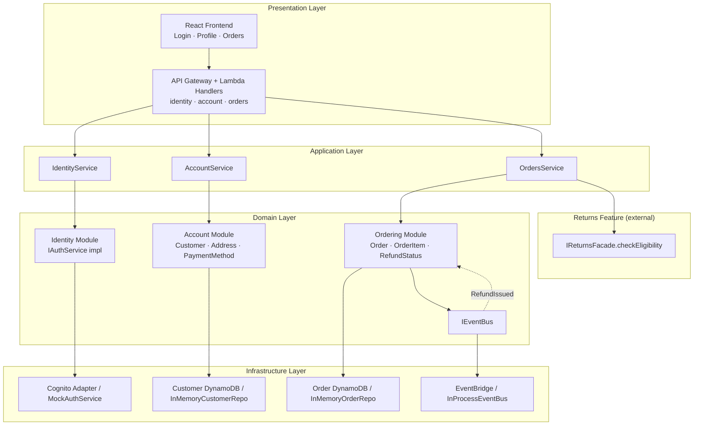
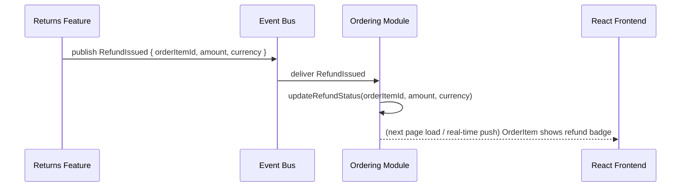

# Design Document: Accounts & Orders

## Overview

Accounts & Orders is the storefront foundation of Second Life Commerce. It delivers three tightly
integrated modules — **Identity**, **Account**, and **Ordering** — wired together through the same
layered, event-driven architecture already established by Zero-Touch Returns.

The critical integration seam: the Order Detail page calls `IReturnsFacade.checkEligibility` (owned
by the Returns feature) to decide per-item button visibility, and subscribes to `RefundIssued` events
to reflect refund status. The Identity module **owns** `IAuthService` — the interface already
consumed by the Returns feature — and provides both a live Cognito adapter and a deterministic mock
that replaces the existing `MockAuthService` at the composition root.

**Key architectural decisions:**
- Three modules (Identity, Account, Ordering) each expose exactly one facade; no module imports
  another's internals
- `IAuthService` remains at `src/domain/shared/IAuthService.ts` (unchanged shape) — this feature
  provides the implementations
- AWS-native deployed mode (Cognito, DynamoDB, EventBridge) with fully in-process local/demo mode
  (mock auth, in-memory repos, in-process event bus) — zero live credentials needed for the demo
- `OrderItem.price` feeds directly into the Returns feature's disposition routing as `itemValue`
- Seed data is computed at runtime relative to `Date.now()` so delivery dates are always current

---

## Architecture

### High-Level System Diagram



### Event-Driven Flow: Refund Reflection



### Return Entry Point Flow (≤3 taps)

```
Tap 1: My Orders list  →  Tap 2: Order Detail page  →  Tap 3: "Return or replace items" button
                                    ↓
               IReturnsFacade.checkEligibility(customerId, orderItemId)
                                    ↓
                eligible=true  → render button   |   eligible=false / error → no button
```

### Layered Folder Structure

New folders added into the existing `src/` tree. Existing paths are not moved.

```
src/
├── domain/
│   ├── shared/
│   │   └── IAuthService.ts           ← existing, shape unchanged; implementations provided here
│   ├── identity/                     ← NEW
│   │   ├── OtpRecord.ts              # value object: contact, code, expiresAt, attemptCount
│   │   ├── Session.ts                # value object: token, customerId, expiresAt
│   │   └── index.ts
│   ├── account/                      ← NEW
│   │   ├── Customer.ts               # aggregate root
│   │   ├── Address.ts                # value object (isDefault flag)
│   │   ├── PaymentMethod.ts          # value object (UPI | Card | COD union)
│   │   ├── NotificationPreferences.ts
│   │   ├── ICustomerRepository.ts
│   │   └── index.ts
│   └── ordering/                     ← NEW
│       ├── Order.ts                  # entity
│       ├── OrderItem.ts              # entity (deliveryDate, unitPrice, refundStatus)
│       ├── RefundStatus.ts           # value object
│       ├── IOrderRepository.ts
│       └── index.ts
│
├── application/
│   ├── identity/                     ← NEW
│   │   ├── IdentityService.ts        # IAuthService impl + OTP flow orchestration
│   │   └── index.ts
│   ├── account/                      ← NEW
│   │   ├── AccountService.ts
│   │   └── index.ts
│   └── ordering/                     ← NEW
│       ├── OrdersService.ts          # subscribes to RefundIssued on construction
│       └── index.ts
│
├── infrastructure/
│   ├── auth/
│   │   ├── MockAuthService.ts        ← existing (replace with new impl that reads seeded orders)
│   │   ├── CognitoAuthAdapter.ts     ← NEW (stretch)
│   │   └── index.ts
│   ├── persistence/
│   │   ├── InMemoryCustomerRepository.ts  ← NEW
│   │   ├── InMemoryOrderRepository.ts     ← NEW
│   │   ├── DynamoCustomerRepository.ts    ← NEW (stretch)
│   │   └── DynamoOrderRepository.ts       ← NEW (stretch)
│   └── seed/
│       └── index.ts                  ← extend with demo customer + demo orders
│
└── presentation/
    ├── api/
    │   ├── identityRoutes.ts         ← NEW
    │   ├── accountRoutes.ts          ← NEW
    │   └── ordersRoutes.ts           ← NEW
    └── web/src/
        ├── pages/
        │   ├── LoginPage.tsx         ← NEW
        │   ├── SignUpPage.tsx        ← NEW
        │   ├── ProfilePage.tsx       ← NEW
        │   ├── AddressBookPage.tsx   ← NEW
        │   ├── PaymentMethodsPage.tsx ← NEW
        │   ├── NotificationPrefsPage.tsx ← NEW
        │   ├── OrdersListPage.tsx    ← NEW
        │   └── OrderDetailPage.tsx   ← NEW
        └── components/
            ├── OrderCard.tsx         ← NEW
            ├── OrderItemRow.tsx      ← NEW (renders return button conditionally)
            └── SkeletonLoader.tsx    ← NEW (reused across pages)
```

---

## Components and Interfaces

### Identity Module

#### IAuthService (existing shape — unchanged)

```typescript
// src/domain/shared/IAuthService.ts  — NO CHANGES to this file
// New implementations are injected at the composition root.

interface IAuthService {
  authenticate(token: string): Promise<Customer | null>;
  verifyOwnership(customerId: string, orderItemId: string): Promise<boolean>;
  getOrderItem(orderItemId: string): Promise<OrderItem | null>;
  getOrderItemsByCustomer(customerId: string): Promise<OrderItem[]>;
}
```

#### OTP Flow Value Objects

```typescript
// src/domain/identity/OtpRecord.ts

interface OtpRecord {
  contact: string;           // email or E.164 phone
  code: string;              // 6-digit numeric string
  expiresAt: Date;           // now + 10 min (configurable)
  attemptsRemaining: number; // default 3 (configurable)
  customerId: string | null; // null for sign-up flow; set for existing customer
}
```

```typescript
// src/domain/identity/Session.ts

interface Session {
  token: string;      // opaque random UUID used as bearer token
  customerId: string;
  expiresAt: Date;    // now + 30 days (configurable)
}
```

#### IOtpStore Interface

```typescript
// src/domain/identity/IOtpStore.ts

/**
 * Storage contract for OTP records and Sessions.
 * In-memory implementation for local/demo; DynamoDB (with TTL) for AWS.
 */
interface IOtpStore {
  saveOtp(record: OtpRecord): Promise<void>;
  findOtp(contact: string): Promise<OtpRecord | null>;
  deleteOtp(contact: string): Promise<void>;

  saveSession(session: Session): Promise<void>;
  findSession(token: string): Promise<Session | null>;
  deleteSession(token: string): Promise<void>;
}
```

Local implementation: `InMemoryOtpStore` — two `Map`s with TTL enforced on read (entries whose
`expiresAt < Date.now()` are treated as absent and pruned lazily).

#### IIdentityService and IAuthService — Separation of Concerns

`IAuthService` (domain/shared — unchanged contract) is the interface the **Returns feature**
depends on. `IIdentityService` is the **application-layer** interface that adds OTP flow operations.
They are deliberately separate so the Returns feature's domain layer never depends on OTP concepts.

```typescript
// src/application/identity/IIdentityService.ts
// Application-layer interface — OTP flow only; NOT extending IAuthService.

interface IIdentityService {
  sendOtp(contact: string): Promise<{ otpSent: boolean; isExistingCustomer: boolean }>;
  verifyOtp(contact: string, code: string): Promise<{ token: string; customerId: string }>;
  logout(token: string): Promise<void>;
}
```

`IdentityService` (the concrete class) implements **both** `IIdentityService` and `IAuthService`:

```typescript
// src/application/identity/IdentityService.ts

class IdentityService implements IIdentityService, IAuthService {
  constructor(
    private readonly customerRepo: ICustomerRepository,
    private readonly orderRepo: IOrderRepository,   // for getOrderItem / verifyOwnership
    private readonly otpStore: IOtpStore,
    private readonly config: AppConfig,
  ) {}

  // ── IAuthService ──────────────────────────────────────────────────────────

  async authenticate(token: string): Promise<AuthServiceCustomer | null> {
    const session = await this.otpStore.findSession(token);
    if (!session || session.expiresAt < new Date()) return null;
    const customer = await this.customerRepo.findById(session.customerId);
    if (!customer) return null;
    return { id: customer.id, name: customer.name, email: customer.email };
  }

  async verifyOwnership(customerId: string, orderItemId: string): Promise<boolean> {
    const result = await this.orderRepo.findOrderItemById(orderItemId);
    return result?.item.customerId === customerId ?? false;  // uses ordering domain OrderItem
  }

  async getOrderItem(orderItemId: string): Promise<AuthServiceOrderItem | null> {
    const result = await this.orderRepo.findOrderItemById(orderItemId);
    if (!result) return null;
    // Map domain OrderItem → IAuthService.OrderItem projection
    return {
      id: result.item.id,
      orderId: result.item.orderId,
      productId: result.item.productId,
      customerId: result.item.customerId,
      deliveryDate: result.item.deliveryDate,
      price: result.item.unitPrice,           // unitPrice → price
      currency: 'INR',                        // from order or config
      productName: result.item.productName,
      productImage: result.item.productImage,
    };
  }

  async getOrderItemsByCustomer(customerId: string): Promise<AuthServiceOrderItem[]> {
    const orders = await this.orderRepo.findByCustomerId(customerId);
    return orders
      .flatMap(o => o.items)
      .filter(i => i.customerId === customerId)
      .map(i => ({
        id: i.id,
        orderId: i.orderId,
        productId: i.productId,
        customerId: i.customerId,
        deliveryDate: i.deliveryDate,
        price: i.unitPrice,
        currency: 'INR',
        productName: i.productName,
        productImage: i.productImage,
      }));
  }

  // ── IIdentityService ──────────────────────────────────────────────────────
  // sendOtp / verifyOtp / logout omitted here for brevity — full impl in tasks
}
```

**Key point:** `IAuthService.OrderItem` (from `domain/shared/IAuthService.ts`) and
`domain/ordering/OrderItem` are **different types** by design. `IdentityService.getOrderItem()`
maps from the full ordering `OrderItem` to the minimal `IAuthService.OrderItem` projection that
the Returns feature needs. The mapping is: `unitPrice → price`; `customerId` is embedded in the
ordering `OrderItem` (it is stored there for exactly this lookup).

#### Mock vs Cognito Adapter

| Concern | `MockAuthService` (local/demo) | `CognitoAuthAdapter` (AWS deployed) |
|---|---|---|
| OTP delivery | No network call; accepts pre-configured code from config | Cognito `InitiateAuth` → SNS/SES |
| Token issuance | Deterministic `DEMO_SESSION_TOKEN` constant for demo contact | Cognito JWT |
| `authenticate(token)` | `IOtpStore` (in-memory session map) | Cognito `GetUser` |
| `verifyOwnership` / `getOrderItem` | `InMemoryOrderRepository` (same instance as `OrdersService`) | DynamoDB `DynamoOrderRepository` |

**Single source of truth for seed data:** `IdentityService` is constructed with the same
`InMemoryOrderRepository` instance used by `OrdersService`. This eliminates the existing
duplication where `MockAuthService` maintained its own private copy of order items. The existing
`MockAuthService` at `src/infrastructure/auth/MockAuthService.ts` is **superseded** by this
`IdentityService` and is no longer registered in the container.

**`loadSeedData()` migration:** The existing `loadSeedData({ authService: MockAuthService, ... })`
is typed to the concrete `MockAuthService`. After this change, `loadSeedData` is replaced by the
seed data being injected directly into `InMemoryOrderRepository` and `InMemoryCustomerRepository`
constructors (see Seed Data section). The `demandSignalProvider` seeding remains unchanged.

---

### Account Module

#### Domain Entities

```typescript
// src/domain/account/Address.ts

interface Address {
  id: string;
  recipientName: string;    // 1–80 chars trimmed
  streetLine1: string;      // 1–100 chars trimmed
  city: string;             // 1–60 chars trimmed
  state: string;            // 1–60 chars trimmed
  pincode: string;          // exactly 6 numeric digits
  country: string;          // 1–60 chars trimmed
  isDefault: boolean;
  createdAt: Date;
}
```

```typescript
// src/domain/account/PaymentMethod.ts

type PaymentMethodType = 'upi' | 'card' | 'cod';

interface UpiMethod {
  type: 'upi';
  upiId: string;            // format: identifier@provider
}

interface CardMethod {
  type: 'card';
  lastFour: string;         // masked — stored only
  expiryMonth: number;      // 1–12
  expiryYear: number;       // 4-digit year
  cardHolderName: string;   // 2–50 chars
}

interface CodMethod {
  type: 'cod';
}

type PaymentMethod = (UpiMethod | CardMethod | CodMethod) & {
  id: string;
  isPreferred: boolean;
  createdAt: Date;
};
```

```typescript
// src/domain/account/NotificationPreferences.ts

type NotificationChannel = 'in_app' | 'email' | 'sms' | 'push';
type NotificationEventType =
  | 'order_placed'
  | 'order_shipped'
  | 'order_delivered'
  | 'return_status_update'
  | 'refund_issued';

// Matrix: all channels × all event types. Default: all enabled.
type NotificationPreferences = Record<NotificationEventType, Record<NotificationChannel, boolean>>;
```

```typescript
// src/domain/account/Customer.ts

interface Customer {
  id: string;
  name: string;              // 1–100 chars trimmed
  email: string;             // verified contact
  addresses: Address[];      // max 10; exactly 0 or 1 with isDefault=true
  paymentMethods: PaymentMethod[]; // max 10; exactly 0 or 1 with isPreferred=true
  notificationPreferences: NotificationPreferences;
  createdAt: Date;
  updatedAt: Date;
}
```

#### ICustomerRepository

```typescript
// src/domain/account/ICustomerRepository.ts

interface ICustomerRepository {
  save(customer: Customer): Promise<void>;
  findById(id: string): Promise<Customer | null>;
  findByContact(contact: string): Promise<Customer | null>; // email or phone lookup
}
```

#### AccountService Facade

```typescript
// src/application/account/AccountService.ts

interface IAccountService {
  // Profile (Req 3)
  getCustomer(customerId: string): Promise<Customer | null>;
  updateProfile(customerId: string, fields: { name: string }): Promise<Customer>;

  // Address Book (Req 4)
  addAddress(customerId: string, address: Omit<Address, 'id' | 'isDefault' | 'createdAt'>): Promise<Customer>;
  updateAddress(customerId: string, addressId: string, fields: Partial<Omit<Address, 'id' | 'isDefault' | 'createdAt'>>): Promise<Customer>;
  removeAddress(customerId: string, addressId: string): Promise<Customer>;
  setDefaultAddress(customerId: string, addressId: string): Promise<Customer>;

  // Payment Methods (Req 5)
  addPaymentMethod(customerId: string, method: Omit<PaymentMethod, 'id' | 'isPreferred' | 'createdAt'>): Promise<Customer>;
  removePaymentMethod(customerId: string, methodId: string): Promise<Customer>;
  getPaymentMethods(customerId: string): Promise<PaymentMethod[]>;

  // Notification Preferences (Req 6)
  updateNotificationPreferences(
    customerId: string,
    preferences: Partial<NotificationPreferences>
  ): Promise<Customer>;
}
```

**Single-default invariant enforcement:** `addAddress`, `removeAddress`, and `setDefaultAddress`
all run through a shared `enforceDefaultInvariant(addresses: Address[]): Address[]` pure function
in `src/domain/account/Customer.ts`. This function is the single place that:
- Ensures at most one `isDefault: true`
- Auto-promotes the most-recently-added address when the default is removed
- Preserves the existing default when a new non-default address is added

---

### Ordering Module

#### Domain Entities

```typescript
// src/domain/ordering/RefundStatus.ts

type RefundStatusCode = 'none' | 'refund_issued';

interface RefundStatus {
  code: RefundStatusCode;
  amount: number | null;     // null when code is 'none'
  currency: string | null;
  issuedAt: Date | null;
}
```

```typescript
// src/domain/ordering/OrderItem.ts

interface OrderItem {
  id: string;
  orderId: string;
  productId: string;
  variantId: string;
  productName: string;
  productImage: string;      // URL; empty string if unavailable
  unitPrice: number;         // in ₹ — feeds Returns disposition as itemValue
  quantity: number;
  deliveryDate: Date;        // drives return eligibility window
  deliveryStatus: 'pending' | 'shipped' | 'delivered' | 'returned';
  refundStatus: RefundStatus;
}
```

```typescript
// src/domain/ordering/Order.ts

type OrderStatus = 'placed' | 'shipped' | 'delivered' | 'cancelled' | 'returned';
type PaymentType = 'prepaid' | 'cod';

interface Order {
  id: string;
  customerId: string;
  placedDate: Date;
  status: OrderStatus;
  paymentType: PaymentType;
  items: OrderItem[];
}
```

#### IOrderRepository

```typescript
// src/domain/ordering/IOrderRepository.ts

interface IOrderRepository {
  save(order: Order): Promise<void>;
  findById(orderId: string): Promise<Order | null>;
  findByCustomerId(customerId: string): Promise<Order[]>;
  findOrderItemById(orderItemId: string): Promise<{ order: Order; item: OrderItem } | null>;
  updateOrderItemRefundStatus(
    orderItemId: string,
    refundStatus: RefundStatus
  ): Promise<void>;
}
```

#### OrdersService Facade

```typescript
// src/application/ordering/OrdersService.ts

interface IOrdersService {
  // My Orders list (Req 7)
  getOrdersByCustomer(customerId: string): Promise<Order[]>; // sorted placedDate desc

  // Order Detail (Req 8)
  getOrderDetail(customerId: string, orderId: string): Promise<Order | null>; // null if not owned

  // Refund status update, called by RefundIssued subscriber (Req 10)
  updateRefundStatus(
    orderItemId: string,
    refundStatus: RefundStatus
  ): Promise<void>; // no-op + log if orderItemId not found
}
```

**`RefundIssued` subscription wiring:** `OrdersService` subscribes to `RefundIssued` at
construction time via `IEventBus.subscribe`. When the event fires it calls
`this.updateRefundStatus(...)` internally. This keeps all refund-reflection logic inside
`OrdersService` without any other module needing to call it.

```typescript
// src/domain/shared/events.ts — new event type added

interface RefundIssuedEvent extends DomainEvent {
  eventType: 'RefundIssued';
  payload: {
    orderItemId: string;
    returnRequestId: string;
    amount: number;
    currency: string;
    issuedAt: string; // ISO date string
  };
}
```

#### Return Entry Point: Eligibility Check Integration

`OrderDetailPage` (React) loads the order, then fires **parallel** eligibility checks for all items.
The API endpoint delegates to `OrdersService.checkReturnEligibility` (not directly to
`IReturnsFacade`) to keep the ordering module boundary intact.

```typescript
// src/application/ordering/OrdersService.ts — additional method

interface IOrdersService {
  // ... existing methods ...

  // Return eligibility (delegates to IReturnsFacade — Req 9)
  checkReturnEligibility(
    customerId: string,
    orderItemId: string
  ): Promise<EligibilityResult>; // re-uses EligibilityResult from returns module
}
```

`OrdersService` receives `IReturnsFacade` as a constructor dependency (injected at composition
root). It calls `returnsFacade.checkEligibility(customerId, orderItemId)` and forwards the result.
The ordering module imports **only the `IReturnsFacade` interface** from the returns module's public
barrel — never any internal class.

```typescript
// Pseudocode in OrderDetailPage.tsx

// Fire all eligibility checks in parallel (Req 9.1, 9.4)
const eligibilityResults = await Promise.allSettled(
  order.items.map(item => api.checkReturnEligibility(item.id))
);

// While loading: per-item skeleton (not a blocking spinner — Req 9, Req 15)
// On settled: render button only if eligible=true; suppress on error (Req 9.5)
```

**React Router paths (≤3 taps — Req 9.6):**

```
/login                          ← unauthenticated redirect target
/orders                         ← Tap 1: My Orders list
/orders/:orderId                ← Tap 2: Order Detail page
/returns/eligibility?orderItemId=X  ← Tap 3: Returns eligibility screen (Returns feature owns this route)
```

All three routes are defined in the React Router config. `/orders` and `/orders/:orderId` are
wrapped in `<AuthGuard>`. Tapping "Return or replace items" navigates to the Returns feature's route
with `orderItemId` as a query parameter — no additional screen intervenes.

---

### Mock Implementations

#### MockAuthService (rebuilt)

```typescript
// src/infrastructure/auth/MockAuthService.ts

// Deterministic implementation of IAuthService for local/demo.
// Reads order data from the SAME InMemoryOrderRepository instance used by OrdersService,
// ensuring a single source of truth for seeded data.
//
// Seeded demo token:
//   token: 'demo-session-token'
//   customerId: 'demo-customer-1'
//
// verifyOwnership(c, i): returns itemMap.get(i)?.customerId === c
// getOrderItem(i):       returns itemMap.get(i) ?? null
// authenticate(token):   returns demoCustomer if token === 'demo-session-token', else null
```

#### InMemoryCustomerRepository

```typescript
// src/infrastructure/persistence/InMemoryCustomerRepository.ts

// In-memory Map<customerId, Customer>.
// findByContact: linear scan on email field.
// save: upsert by id.
// Pre-loaded with the Demo_Customer on construction.
```

#### InMemoryOrderRepository

```typescript
// src/infrastructure/persistence/InMemoryOrderRepository.ts

// In-memory Map<orderId, Order>.
// findByCustomerId: filter by customerId.
// findOrderItemById: scan orders for matching item id.
// updateOrderItemRefundStatus: mutate in place; no-op if not found.
// Pre-loaded with demo orders on construction (see Seed Data section).
```

---

### Repository Interfaces Summary

| Interface | Domain | Purpose |
|---|---|---|
| `ICustomerRepository` | `domain/account` | Customer CRUD |
| `IOrderRepository` | `domain/ordering` | Order + OrderItem CRUD + refund status update |
| `IReturnRequestRepository` | `domain/returns` (existing) | unchanged |

---

## Data Models

### Customer Entity (DynamoDB — stretch)

| Attribute | Type | Key |
|---|---|---|
| PK | `CUSTOMER#<customerId>` | Partition Key |
| SK | `PROFILE` | Sort Key |
| name | String | |
| email | String | GSI1-PK |
| addresses | List<Map> | |
| paymentMethods | List<Map> | |
| notificationPreferences | Map | |
| createdAt | String (ISO) | |
| updatedAt | String (ISO) | |

**GSI1:** `email` (PK) — lookup by contact for sign-up deduplication and login

### Orders Table (DynamoDB — stretch)

| Attribute | Type | Key |
|---|---|---|
| PK | `ORDER#<orderId>` | Partition Key |
| SK | `META` | Sort Key |
| customerId | String | GSI1-PK |
| placedDate | String (ISO) | GSI1-SK |
| status | String | |
| paymentType | String | |

**GSI1:** `customerId` (PK) + `placedDate` (SK) — query orders by customer, sorted by date desc

### OrderItems Table (DynamoDB — stretch)

| Attribute | Type | Key |
|---|---|---|
| PK | `ORDER#<orderId>` | Partition Key |
| SK | `ITEM#<orderItemId>` | Sort Key |
| productId | String | |
| variantId | String | |
| productName | String | |
| productImage | String | |
| unitPrice | Number | GSI1-PK |
| quantity | Number | |
| deliveryDate | String (ISO) | |
| deliveryStatus | String | |
| refundStatusCode | String | |
| refundAmount | Number (nullable) | |
| refundCurrency | String (nullable) | |
| refundIssuedAt | String (nullable) | |

**GSI1:** `orderItemId` (PK) — single-item lookup for `getOrderItem` / `verifyOwnership`

**Alternative:** Store items as a nested list on the order item in local mode (simpler for the
in-memory repo). Use the separate items table only for DynamoDB to avoid large-item limits.

### OTP + Session Storage (in-memory / ElastiCache stretch)

```typescript
// Local: two in-memory Maps (TTL enforced on read)
//   otpStore: Map<contact, OtpRecord>
//   sessionStore: Map<token, Session>
//
// AWS: DynamoDB with TTL attribute or ElastiCache (stretch)
```

---

## Seed Data

All delivery dates are computed relative to `Date.now()` at startup to remain valid across
restarts. The configured `Return_Window` default is 30 days.

```typescript
// src/infrastructure/seed/index.ts — additions

export const DEMO_CUSTOMER_ID = 'demo-customer-1';
export const DEMO_SESSION_TOKEN = 'demo-session-token';

export const demoCustomer: Customer = {
  id: DEMO_CUSTOMER_ID,
  name: 'Priya Demo',
  email: 'demo@secondlife.in',
  addresses: [
    {
      id: 'addr-1',
      recipientName: 'Priya Demo',
      streetLine1: '42 MG Road',
      city: 'Bengaluru',
      state: 'Karnataka',
      pincode: '560001',
      country: 'India',
      isDefault: true,
      createdAt: new Date('2024-01-01'),
    },
  ],
  paymentMethods: [
    { id: 'pm-1', type: 'upi', upiId: 'priya@okaxis', isPreferred: true, createdAt: new Date('2024-01-01') },
    { id: 'pm-2', type: 'cod', isPreferred: false, createdAt: new Date('2024-01-01') },
  ],
  notificationPreferences: defaultAllEnabled(),
  createdAt: new Date('2024-01-01'),
  updatedAt: new Date('2024-01-01'),
};

// Order 1 — DELIVERED, prepaid, item inside Return_Window (deliveryDate = now - 2 days)
export const demoPrepaidOrder: Order = {
  id: 'order-demo-1',
  customerId: DEMO_CUSTOMER_ID,
  placedDate: new Date(Date.now() - 5 * DAY_MS),
  status: 'delivered',
  paymentType: 'prepaid',
  items: [
    {
      id: 'oi-demo-eligible',        // used by Returns feature seeded data
      orderId: 'order-demo-1',
      productId: 'prod-demo-1',
      variantId: 'var-demo-1',
      productName: 'Wireless Headphones Pro',
      productImage: '/demo/headphones.jpg',
      unitPrice: 2999,
      quantity: 1,
      deliveryDate: new Date(Date.now() - 2 * DAY_MS),  // 2 days ago — WITHIN window
      deliveryStatus: 'delivered',
      refundStatus: { code: 'none', amount: null, currency: null, issuedAt: null },
    },
    {
      id: 'oi-demo-ineligible',      // demonstrates the "no button" edge case
      orderId: 'order-demo-1',
      productId: 'prod-demo-2',
      variantId: 'var-demo-2',
      productName: 'Phone Case',
      productImage: '/demo/case.jpg',
      unitPrice: 299,
      quantity: 1,
      deliveryDate: new Date(Date.now() - 45 * DAY_MS), // 45 days ago — OUTSIDE 30-day window
      deliveryStatus: 'delivered',
      refundStatus: { code: 'none', amount: null, currency: null, issuedAt: null },
    },
  ],
};

// Order 2 — DELIVERED, COD  (Req 13.5)
export const demoCodOrder: Order = {
  id: 'order-demo-2',
  customerId: DEMO_CUSTOMER_ID,
  placedDate: new Date(Date.now() - 10 * DAY_MS),
  status: 'delivered',
  paymentType: 'cod',
  items: [
    {
      id: 'oi-demo-cod-1',
      orderId: 'order-demo-2',
      productId: 'prod-demo-3',
      variantId: 'var-demo-3',
      productName: 'Running Shoes (Adidas)',
      productImage: '/demo/shoes.jpg',
      unitPrice: 3499,
      quantity: 1,
      deliveryDate: new Date(Date.now() - 8 * DAY_MS), // 8 days ago — WITHIN window
      deliveryStatus: 'delivered',
      refundStatus: { code: 'none', amount: null, currency: null, issuedAt: null },
    },
  ],
};
```

**Idempotency:** `InMemoryOrderRepository` and `InMemoryCustomerRepository` constructors accept
the seed data directly; seeding is a one-time construction step. Calling `save` with the same
`id` is an upsert (overwrites), so repeated invocations of `initSeed()` produce the same state.

---

## Domain Event: RefundIssued

`RefundIssued` is a **new event** added to `src/domain/shared/events.ts`. It is **published by the
Returns feature** (specifically by `DispositionOrchestrator` / `ReturnsFacade`) when a refund is
finalised — either immediately (returnless refund, instant match) or after review (refurbishment,
manual inspection). This is distinct from `ReturnCompletedEvent` (which signals the lifecycle end)
and `DispositionAssignedEvent` (which carries only an estimate).

**Publisher:** `DispositionOrchestrator` publishes `RefundIssued` after confirming the refund amount
is determined (either immediately on completion routes, or when the Returns feature transitions the
item to `Completed`). For the local/demo flow, this fires immediately after `DispositionAssigned`
for instant-refund routes.

```typescript
// src/domain/shared/events.ts — append to existing file

interface RefundIssuedEvent extends DomainEvent {
  eventType: 'RefundIssued';
  payload: {
    orderItemId: string;       // the Ordering module's item id
    returnRequestId: string;   // back-reference for tracing
    amount: number;            // ≥ 0; 0 is valid for donate/recycle (green credits instead)
    currency: string;          // e.g. 'INR'
    issuedAt: string;          // ISO 8601 date string
  };
}
```

**Subscriber logic in `OrdersService`:**

```typescript
eventBus.subscribe('RefundIssued', async (event) => {
  const e = event as RefundIssuedEvent;
  const { orderItemId, amount, currency, issuedAt } = e.payload;

  const found = await this.orderRepo.findOrderItemById(orderItemId);
  if (!found) {
    console.warn('[OrdersService] RefundIssued for unknown orderItemId', { orderItemId });
    return; // graceful no-op — Req 10.3
  }

  // Last-write-wins overwrite — satisfies idempotence property C
  await this.orderRepo.updateOrderItemRefundStatus(orderItemId, {
    code: 'refund_issued',
    amount,
    currency,
    issuedAt: new Date(issuedAt),
  });
});
```

---

## Authentication Guard

The `IdentityService.authenticate(token)` method is the single enforcement point. API handlers
call it on every request and reject with HTTP 401 if it returns null. React routes wrap protected
pages in an `<AuthGuard>` component that reads the stored `sessionToken` from `localStorage`,
calls the `/identity/me` endpoint, and redirects to `/login?returnTo=<currentPath>` if
unauthenticated.

```typescript
// src/presentation/web/src/components/AuthGuard.tsx

function AuthGuard({ children }: { children: React.ReactNode }) {
  const { customer, loading } = useAuth(); // context reads localStorage token + /identity/me

  if (loading) return <SkeletonLoader />;       // Req 14.4 — no personal data before auth confirmed
  if (!customer) {
    navigate(`/login?returnTo=${encodeURIComponent(location.pathname)}`);
    return null;
  }
  return <>{children}</>;
}
```

All routes under `/orders`, `/account`, `/profile` are wrapped in `<AuthGuard>`. Post-login,
`IdentityService` reads the `returnTo` query parameter and redirects back (Req 14.2).

---

## Correctness Properties (Design-level)

These complement the requirements-level properties and specify invariants that implementations must
uphold during construction.

### Property A: Address Default Invariant

*For any* Customer C and any sequence of `addAddress`, `removeAddress`, `setDefaultAddress`
operations applied via `AccountService`, the number of Address entries in `C.addresses` with
`isDefault === true` SHALL be 0 (empty book) or exactly 1.

**Enforced by:** `enforceDefaultInvariant()` pure function called in every mutating method of
`AccountService` before persisting. Unit tested with property-based tests.

### Property B: Customer Isolation

*For any* two distinct customers C1 and C2, `getOrdersByCustomer(C1.id)` SHALL return only Orders
where `order.customerId === C1.id`. `getOrderDetail(C1.id, orderId)` SHALL return null if the
order's `customerId !== C1.id`.

**Enforced by:** `IOrderRepository.findByCustomerId` filters on `customerId` field.
`OrdersService.getOrderDetail` checks ownership after retrieval and returns null on mismatch.

### Property C: Idempotent Refund Reflection

*For any* `RefundIssued` event E with `(orderItemId, amount)`, processing E N times SHALL produce
the same `refundStatus` as processing it once — the final state is the last event's values (last-
write-wins). No amounts are accumulated.

**Enforced by:** `updateOrderItemRefundStatus` is a plain overwrite (not increment).

### Property D: Seed Idempotence

*For any* number of `initSeed()` invocations, the resulting state of `InMemoryCustomerRepository`
and `InMemoryOrderRepository` SHALL contain exactly the seeded Demo_Customer and demo orders — no
duplicates.

**Enforced by:** Both repos use `Map.set(id, value)` (upsert semantics). `initSeed()` is called
once at DI composition root construction.

---

## API Routes

```
POST /identity/otp/send        — sendOtp(contact)
POST /identity/otp/verify      — verifyOtp(contact, code) → { token }
POST /identity/logout          — logout(token)
GET  /identity/me              — authenticate(token) → Customer

GET  /account/profile          — getCustomer
PUT  /account/profile          — updateProfile
GET  /account/addresses        — getCustomer().addresses
POST /account/addresses        — addAddress
PUT  /account/addresses/:id    — updateAddress
DELETE /account/addresses/:id  — removeAddress
PUT  /account/addresses/:id/default — setDefaultAddress
GET  /account/payment-methods  — getPaymentMethods
POST /account/payment-methods  — addPaymentMethod
DELETE /account/payment-methods/:id — removePaymentMethod
GET  /account/notifications    — getCustomer().notificationPreferences
PUT  /account/notifications    — updateNotificationPreferences

GET  /orders                   — getOrdersByCustomer
GET  /orders/:orderId          — getOrderDetail
GET  /orders/items/:orderItemId/eligibility — OrdersService.checkReturnEligibility
                                             (delegates internally to IReturnsFacade)
```

**Error responses:** All routes return structured errors `{ code, message }` with appropriate HTTP
status codes:
- `400` — validation errors (missing field, invalid format)
- `401` — unauthenticated (missing or invalid Session_Token)
- `403` — authenticated but not authorized (wrong customerId)
- `404` — resource not found
- `409` — conflict (duplicate UPI ID, duplicate sign-up)
- `500` — unexpected server error (never leaks raw exceptions)

---

## DI Composition Root Updates

**Wiring order (no circular dependencies):**
1. `orderRepo` — no deps
2. `customerRepo` — no deps  
3. `otpStore` — no deps
4. `identityService` — needs `customerRepo`, `orderRepo`, `otpStore`
5. `returnsFacade` — needs `identityService` (as `IAuthService`), `eventBus`, `returnRequestRepo`
6. `accountService` — needs `customerRepo`
7. `ordersService` — needs `orderRepo`, `returnsFacade` (as `IReturnsFacade`), `eventBus`
8. `dispositionOrchestrator` — needs `eventBus`, `returnRequestRepo`, `orderRepo`

```typescript
// src/infrastructure/config/container.ts — additions

// Repos
const customerRepo  = new InMemoryCustomerRepository([demoCustomer]);
const orderRepo     = new InMemoryOrderRepository([demoPrepaidOrder, demoCodOrder]);
const otpStore      = new InMemoryOtpStore();

// Pre-seed the demo session token so the demo works without OTP
otpStore.saveSession({
  token: DEMO_SESSION_TOKEN,
  customerId: DEMO_CUSTOMER_ID,
  expiresAt: new Date(Date.now() + 365 * DAY_MS), // never expires in demo
});

// Identity — implements BOTH IIdentityService and IAuthService
const identityService = new IdentityService(customerRepo, orderRepo, otpStore, config);

// ReturnsFacade receives identityService as IAuthService (replaces old MockAuthService)
const returnsFacade = new ReturnsFacade(
  config,
  identityService,              // ← IAuthService
  container.getRequired('returnRequestRepository'),
  container.getRequired('eventBus'),
  gradingOrchestrator,
  container.getRequired('conditionAssessmentRepository'),
  container.getRequired('auditLogRepository'),
);

// Account and Orders services
const accountService = new AccountService(customerRepo);
const ordersService  = new OrdersService(orderRepo, returnsFacade, eventBus);
//                                        ↑ subscribes to RefundIssued on construction

// Register all
container.register('authService', identityService);
container.register('identityService', identityService);
container.register('accountService', accountService);
container.register('ordersService', ordersService);

// DemandSignalProvider seed (unchanged from existing code)
const demandSignalProvider = new InMemoryDemandSignalProvider();
demandSignalProvider.addSignal('prod-demo-1', { buyerId: 'buyer-001', distanceKm: 15, matchType: 'active_order' });
// Also keep existing item-grade-a signal for Returns feature hero path
demandSignalProvider.addSignal('item-grade-a', SEED_DEMAND_SIGNAL.signal);
```

**Canonical demo IDs (single source of truth — replaces both old `customer-001` and new `demo-customer-1`):**

```typescript
// src/infrastructure/seed/index.ts — updated constants
export const DEMO_CUSTOMER_ID    = 'customer-001';       // keep existing ID — no break
export const DEMO_SESSION_TOKEN  = 'demo-session-token'; // new constant
export const DEMO_EMAIL          = 'priya@example.com';  // keep existing email
```

The existing `customer-001` / `order-item-001` IDs from `MockAuthService` are **preserved** as the
canonical demo IDs. The new seed adds the same items to `InMemoryOrderRepository` using those same
IDs. This ensures the existing `ReturnsFacade` tests and hero-path wiring continue to work without
change.

---

## Domain Error Types

Each module defines typed errors. API route handlers catch these and map them to HTTP status codes
without leaking internal stack traces or raw exception messages.

```typescript
// src/domain/account/errors.ts

export class CustomerNotFoundError extends Error {
  constructor(customerId: string) {
    super(`Customer '${customerId}' not found.`);
  }
}
export class AddressNotFoundError extends Error {}
export class AddressValidationError extends Error {
  constructor(public readonly invalidFields: string[]) {
    super(`Address validation failed: ${invalidFields.join(', ')}`);
  }
}
export class DuplicatePaymentMethodError extends Error {}
export class PaymentMethodCapExceededError extends Error {
  constructor() { super('Maximum of 10 payment methods reached.'); }
}
export class PaymentMethodNotFoundError extends Error {}

// src/domain/identity/errors.ts

export class OtpInvalidError extends Error {}
export class OtpExpiredError extends Error {}
export class OtpMaxAttemptsError extends Error {}
export class OtpLockedError extends Error {
  constructor(public readonly retryAfterMs: number) {
    super('Too many failed attempts. Try again later.');
  }
}
export class ContactAlreadyRegisteredError extends Error {}
export class ContactNotRegisteredError extends Error {}
export class SessionNotFoundError extends Error {}
```

**HTTP status mapping (in API route handlers):**

| Error class | HTTP status |
|---|---|
| `AddressValidationError`, `PaymentMethodCapExceededError` | 400 |
| `OtpInvalidError`, `OtpExpiredError`, `SessionNotFoundError` | 401 |
| Cross-customer access attempt | 403 |
| `CustomerNotFoundError`, `AddressNotFoundError`, `PaymentMethodNotFoundError` | 404 |
| `DuplicatePaymentMethodError`, `ContactAlreadyRegisteredError` | 409 |
| Unhandled errors | 500 (message: "An unexpected error occurred") |

---

## Helper: `defaultAllEnabled()`

```typescript
// src/domain/account/NotificationPreferences.ts — exported helper

export function defaultAllEnabled(): NotificationPreferences {
  const channels: NotificationChannel[] = ['in_app', 'email', 'sms', 'push'];
  const events: NotificationEventType[] = [
    'order_placed', 'order_shipped', 'order_delivered',
    'return_status_update', 'refund_issued',
  ];
  const prefs = {} as NotificationPreferences;
  for (const evt of events) {
    prefs[evt] = {} as Record<NotificationChannel, boolean>;
    for (const ch of channels) {
      prefs[evt][ch] = true; // all enabled by default — Req 6.5
    }
  }
  return prefs;
}
```

---

## Error Handling

All facades throw typed domain errors (defined above). API handlers never let raw errors reach
the network layer. The React frontend shows inline validation messages for 400/409 responses and
redirects to `/login` on 401. A global error boundary catches unexpected 500s and shows a friendly
"Something went wrong" screen with a retry option.

The `OrdersService.checkReturnEligibility` method wraps `IReturnsFacade.checkEligibility` in a
try/catch — any exception from the Returns feature is caught, logged, and translated to
`{ eligible: false, errorMessage: 'Eligibility check temporarily unavailable' }` so the ordering
module is never brought down by a Returns feature error.

---

## Testing Strategy

### Unit tests (domain layer — no I/O)

| File | What it tests |
|---|---|
| `enforceDefaultInvariant.test.ts` | Property-based: single-default invariant after arbitrary add/remove/set-default sequences |
| `NotificationPreferences.test.ts` | `defaultAllEnabled()` returns full 5×4 matrix all `true` |
| `Address.validation.test.ts` | Required field validation, pincode regex |
| `PaymentMethod.validation.test.ts` | UPI ID format, card masking, duplicate rejection |
| `OtpRecord.test.ts` | Expiry window, attempt count decrement |
| `Session.test.ts` | Token expiry check |

### Integration tests (application layer — in-memory repos)

| File | What it tests |
|---|---|
| `AccountService.test.ts` | Round-trip profile update, address book invariants, payment method add/remove |
| `OrdersService.test.ts` | Customer isolation, refund status reflection (idempotence), graceful unknown-order handling |
| `IdentityService.test.ts` | OTP send/verify round-trip, lockout after max attempts, `IAuthService` delegation |

### Property-based tests (fast-check)

| Property | Validates |
|---|---|
| Single-default invariant | Req 4 correctness property |
| Customer isolation in `getOrdersByCustomer` | Req 7 correctness property |
| Idempotent refund reflection | Req 10 correctness property |
| Ownership correctness: `verifyOwnership ↔ getOrderItem` | Req 11 correctness property |
| Round-trip: `save → findById` for Customer and Order | Req 12 correctness property |
| Seed idempotence: N × `initSeed()` produces same state | Req 13 correctness property |
