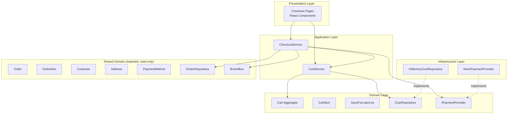

# Design Document: Cart & Checkout

## Overview

The Cart & Checkout module provides the complete purchase flow for the Second Life Commerce platform. It enables customers to build a shopping cart from available product variants (new and second-life), manage items (quantity changes, save-for-later), and proceed through a multi-step checkout culminating in order creation and an `OrderPlaced` domain event.

### Key Design Decisions

1. **Reuse existing domain entities** — Order, OrderItem, Customer, Address, PaymentMethod are imported from `src/domain/ordering` and `src/domain/account`; this module never modifies those shapes.
2. **Cart as a domain aggregate** — Cart is a new aggregate in `src/domain/cart` with CartItem value objects. It owns its invariants (max 50 items, max 10 per line, stock validation).
3. **Adapter pattern for payment** — `IPaymentProvider` abstracts payment processing; a `MockPaymentProvider` ships for demo mode (deterministic, no live keys needed).
4. **In-memory persistence** — `InMemoryCartRepository` satisfies the `ICartRepository` interface for local/demo mode; a DynamoDB adapter can be swapped in via DI.
5. **Event-driven integration** — After successful order persistence, `CheckoutService` publishes a single `OrderPlaced` event on the shared `IEventBus`. No other module is imported internally.
6. **Configuration-driven delivery & RTO** — Delivery options (Standard/Express), high-RTO pincodes, and fees live in a typed config object injected into the services.

### Scope Boundaries

- **In scope:** `src/domain/cart`, `src/application/cart`, `src/presentation/web/src/pages/checkout`
- **Out of scope:** Modifying existing Customer, Address, PaymentMethod, Order, OrderItem entities; real payment gateway integration; real DynamoDB persistence (stretch).

---

## Architecture



### Dependency Flow

- Presentation → Application → Domain ← Infrastructure
- `CheckoutService` depends on interfaces: `ICartRepository`, `IPaymentProvider`, `IOrderRepository`, `IOrderMetadataRepository`, `IEventBus`
- `CartService` depends on: `ICartRepository`, `IVariantRepository` (from catalog, for stock checks)
- No circular dependencies; all concrete implementations injected at composition root.

---

## Components and Interfaces

### Domain Layer (`src/domain/cart/`)

#### `Cart` — Aggregate Root

The Cart is a per-customer collection that owns its invariants.

```typescript
interface CartProps {
  id: string;
  customerId: string;
  items: CartItem[];
  saveForLater: SaveForLaterItem[];
  updatedAt: Date;
}
```

**Invariants:**
- Maximum 50 distinct CartItems
- Each CartItem quantity: 1–10 inclusive
- A CartItem references exactly one ProductVariant

#### `CartItem` — Value Object

```typescript
interface CartItem {
  variantId: string;
  productId: string;
  productName: string;
  productImage: string;
  unitPrice: number;      // snapshot from ProductVariant.price
  condition: Condition;   // 'New' | 'Certified_Renewed' | 'Open_Box' | 'Used_Like_New'
  quantity: number;       // 1–10
}
```

#### `SaveForLaterItem` — Value Object

```typescript
interface SaveForLaterItem {
  variantId: string;
  productId: string;
  productName: string;
  productImage: string;
  unitPrice: number;
  condition: Condition;
  savedAt: Date;
}
```

#### `ICartRepository` — Interface

```typescript
interface ICartRepository {
  findByCustomerId(customerId: string): Promise<Cart | null>;
  save(cart: Cart): Promise<void>;
}
```

#### `IPaymentProvider` — Interface

```typescript
interface PaymentResult {
  success: boolean;
  transactionId?: string;   // present when success=true
  failureReason?: string;   // present when success=false
}

interface IPaymentProvider {
  processPayment(
    amount: number,          // 0.01–999,999,999.99
    currency: string,        // "INR"
    paymentMethod: PaymentMethod
  ): Promise<PaymentResult>;
}
```

#### `IOrderMetadataRepository` — Interface

```typescript
interface OrderMetadata {
  orderId: string;
  highRtoFlag: boolean;
  createdAt: Date;
}

interface IOrderMetadataRepository {
  save(metadata: OrderMetadata): Promise<void>;
  findByOrderId(orderId: string): Promise<OrderMetadata | null>;
}
```

Stores cart/checkout-specific metadata (like the high-RTO flag) without modifying the shared Order entity.

#### `CartConfig` — Configuration

```typescript
interface DeliveryOption {
  id: string;
  name: string;
  minDays: number;
  maxDays: number;
  cost: number;           // ₹0 for Standard, configurable for Express
}

interface CartConfig {
  maxItemsPerCart: number;          // 50
  maxQuantityPerItem: number;       // 10
  maxQuantityAbsolute: number;      // 99 (validation ceiling)
  deliveryOptions: DeliveryOption[];
  expressFee: number;               // e.g. ₹49
  highRtoPincodes: string[];        // 6-digit strings
  paymentTimeoutMs: number;         // 30000
  eventRetryAttempts: number;       // 3
  cartClearRetryAttempts: number;   // 3
}
```

### Application Layer (`src/application/cart/`)

#### `CartService` — Facade

```typescript
interface ICartService {
  getCart(customerId: string): Promise<CartView>;
  addItem(customerId: string, variantId: string): Promise<CartOperationResult>;
  removeItem(customerId: string, variantId: string): Promise<CartOperationResult>;
  updateQuantity(customerId: string, variantId: string, quantity: number): Promise<CartOperationResult>;
  moveToSaveForLater(customerId: string, variantId: string): Promise<CartOperationResult>;
  moveBackToCart(customerId: string, variantId: string): Promise<CartOperationResult>;
  clearCart(customerId: string): Promise<void>;
}

interface CartView {
  items: CartItem[];
  saveForLater: SaveForLaterItem[];
  subtotal: number;       // sum of (unitPrice × quantity), rounded to 2 decimal places
  itemCount: number;      // sum of quantities
  canCheckout: boolean;   // items.length > 0
}

interface CartOperationResult {
  success: boolean;
  cart: CartView;
  notice?: string;        // e.g. "Quantity capped to available stock"
  error?: string;         // e.g. "Item out of stock"
}
```

#### `CheckoutService` — Facade

```typescript
interface ICheckoutService {
  getAddresses(customerId: string): Promise<Address[]>;
  getDeliveryOptions(): DeliveryOption[];
  getPaymentMethods(customerId: string): Promise<PaymentMethodView[]>;
  isHighRtoPincode(pincode: string): boolean;
  validateStock(customerId: string): Promise<StockValidationResult>;
  placeOrder(customerId: string, params: PlaceOrderParams): Promise<PlaceOrderResult>;
}

interface PlaceOrderParams {
  addressId: string;
  deliveryOptionId: string;
  paymentMethodId: string;    // or 'cod'
}

interface StockValidationResult {
  valid: boolean;
  unavailableItems: Array<{
    variantId: string;
    productName: string;
    requestedQty: number;
    availableStock: number;
  }>;
}

interface PlaceOrderResult {
  success: boolean;
  orderId?: string;
  estimatedDelivery?: { min: Date; max: Date };
  items?: OrderItemSummary[];
  error?: string;
  failureReason?: string;
}

interface OrderItemSummary {
  productName: string;
  productImage: string;
  quantity: number;
  unitPrice: number;
}

interface PaymentMethodView {
  id: string;
  type: 'upi' | 'card' | 'cod';
  label: string;            // e.g. "UPI: user@upi" or "Card: ****1234"
  isPreferred: boolean;
}
```

### Infrastructure Layer (`src/infrastructure/persistence/` and `src/infrastructure/payment/`)

#### `InMemoryCartRepository`

Located at `src/infrastructure/persistence/InMemoryCartRepository.ts` (follows existing pattern: `InMemoryCustomerRepository` lives in the same directory).

Implements `ICartRepository` using a `Map<string, Cart>` keyed by customerId. Deterministic, no external dependencies.

#### `InMemoryOrderMetadataRepository`

Located at `src/infrastructure/persistence/InMemoryOrderMetadataRepository.ts`.

Implements `IOrderMetadataRepository` using a `Map<string, OrderMetadata>` keyed by orderId.

#### `MockPaymentProvider`

Located at `src/infrastructure/payment/MockPaymentProvider.ts`.

Implements `IPaymentProvider` with:
- Successful result: `{ success: true, transactionId: "mock-txn-{amount}-{currency}" }`
- Failure on `upiId === "fail@test"` or `lastFour === "0000"`
- Failure on amount out of range (< 0.01 or > 999,999,999.99)

### Presentation Layer (`src/presentation/web/src/pages/checkout/`)

React components implementing the multi-step checkout flow:

| Component | Responsibility |
|-----------|---------------|
| `CartPage` | Display cart items, subtotal, save-for-later, checkout button |
| `CheckoutLayout` | Step indicator, navigation, state preservation |
| `AddressStep` | List saved addresses, select, add new |
| `DeliveryStep` | Display delivery options, select, show updated total |
| `PaymentStep` | Display payment methods + COD, high-RTO warning |
| `ReviewStep` | Order summary, total breakdown, place order button |
| `ConfirmationStep` | Order ID, estimated delivery, item summary |

---

## Data Models

### Cart Aggregate (persisted via ICartRepository)

```typescript
// Stored shape in InMemoryCartRepository
{
  id: string;                   // UUID
  customerId: string;           // references Customer.id
  items: CartItem[];            // max 50
  saveForLater: SaveForLaterItem[];
  updatedAt: Date;
}
```

### OrderPlaced Event Payload

```typescript
interface OrderPlacedEvent extends DomainEvent {
  eventType: 'OrderPlaced';
  payload: {
    orderId: string;
    customerId: string;
    paymentType: 'prepaid' | 'cod';
    orderItemIds: string[];
    highRtoFlag: boolean;
  };
}
```

### OrderMetadata (cart module internal, persisted via IOrderMetadataRepository)

```typescript
interface OrderMetadata {
  orderId: string;
  highRtoFlag: boolean;
  createdAt: Date;
}

interface IOrderMetadataRepository {
  save(metadata: OrderMetadata): Promise<void>;
  findByOrderId(orderId: string): Promise<OrderMetadata | null>;
}
```

The `highRtoFlag` is stored in this cart-module-internal structure rather than on the shared `Order` entity (which this module must not modify). The flag is also propagated via the `OrderPlaced` event payload for downstream consumers.

### Delivery Configuration (injected)

```typescript
const defaultCartConfig: CartConfig = {
  maxItemsPerCart: 50,
  maxQuantityPerItem: 10,
  maxQuantityAbsolute: 99,
  deliveryOptions: [
    { id: 'standard', name: 'Standard', minDays: 5, maxDays: 7, cost: 0 },
    { id: 'express', name: 'Express', minDays: 1, maxDays: 3, cost: 49 },
  ],
  expressFee: 49,
  highRtoPincodes: ['110001', '400001', '560001'],  // configurable seed
  paymentTimeoutMs: 30000,
  eventRetryAttempts: 3,
  cartClearRetryAttempts: 3,
};
```

### Relationships to Existing Entities

| This Module | References | From |
|-------------|-----------|------|
| CartItem.variantId | ProductVariant.id | `src/domain/catalog` |
| CartItem.productId | Product.id | `src/domain/catalog` |
| Cart.customerId | Customer.id | `src/domain/account` |
| Order (created) | Order interface | `src/domain/ordering` |
| OrderItem (created) | OrderItem interface | `src/domain/ordering` |
| CheckoutService | IOrderRepository | `src/domain/ordering` |
| CheckoutService | IEventBus | `src/domain/shared` |

**Note on stock decrement:** This module does NOT decrement `ProductVariant.stock` on order placement — that is the responsibility of a catalog-module handler subscribed to the `OrderPlaced` event (outside this spec's scope). Stock checks in this module are read-only.


---

## Correctness Properties

*A property is a characteristic or behavior that should hold true across all valid executions of a system — essentially, a formal statement about what the system should do. Properties serve as the bridge between human-readable specifications and machine-verifiable correctness guarantees.*

### Property 1: Adding a valid variant grows the cart

*For any* cart and any valid ProductVariant (in-stock, not at max quantity) that is either not in the cart or already present with quantity < 10, adding it SHALL either create a new CartItem with quantity 1 (if new) or increment the existing item's quantity by 1.

**Validates: Requirements 1.1, 1.2**

### Property 2: Cart quantity invariants are enforced

*For any* cart, the number of distinct CartItems SHALL never exceed 50, and each CartItem's quantity SHALL always be in [1, 10]. Any operation that would violate these bounds is rejected.

**Validates: Requirements 1.7, 4.5**

### Property 3: Stock-constrained additions

*For any* ProductVariant with zero stock, adding it to the cart SHALL be rejected. *For any* CartItem where incrementing the quantity would exceed the variant's available stock, the quantity SHALL be capped at available stock.

**Validates: Requirements 1.3, 1.4**

### Property 4: CartItem captures variant details

*For any* ProductVariant added to the cart, the resulting CartItem SHALL contain the variant's id, productId, productName, catalogImageUrl, price, and condition — matching the source ProductVariant exactly.

**Validates: Requirements 1.5**

### Property 5: Removing an item reduces cart and subtotal

*For any* cart containing a CartItem, removing it SHALL result in the cart no longer containing that item, and the new subtotal SHALL equal the old subtotal minus (removedItem.unitPrice × removedItem.quantity).

**Validates: Requirements 2.1, 2.2**

### Property 6: Cross-customer cart isolation

*For any* two distinct customer IDs, a remove/update operation on customer A's cart using customer B's identity SHALL be rejected with an authorization error, leaving both carts unchanged.

**Validates: Requirements 2.4**

### Property 7: Quantity update semantics

*For any* CartItem and any integer quantity in [0, 99]: if quantity is in [1, 99], the CartItem's quantity SHALL be set to min(quantity, availableStock, maxQuantityPerItem=10); if quantity is 0, the CartItem SHALL be removed from the cart.

**Validates: Requirements 3.1, 3.2, 3.3**

### Property 8: Invalid quantity rejection

*For any* quantity that is negative, non-integer, or greater than 99, updating a CartItem's quantity SHALL be rejected with a validation error and the cart SHALL remain unchanged.

**Validates: Requirements 3.5**

### Property 9: Subtotal and item count computation

*For any* set of CartItems, the subtotal SHALL equal the sum of (unitPrice × quantity) for each item rounded to 2 decimal places using half-up rounding, and the itemCount SHALL equal the sum of all quantities.

**Validates: Requirements 4.1, 4.2, 4.4**

### Property 10: Unavailable items excluded from subtotal

*For any* cart containing CartItems that reference ProductVariants with zero stock, those items SHALL be excluded from the subtotal calculation and the response SHALL identify which items are unavailable.

**Validates: Requirements 4.6**

### Property 11: Save-for-later round trip

*For any* CartItem moved to save-for-later, it SHALL be removed from the cart and appear in the SaveForLaterList. *For any* SaveForLaterItem with available stock moved back to cart, it SHALL be removed from the list and added to the cart with quantity 1.

**Validates: Requirements 5.1, 5.2**

### Property 12: Save-for-later idempotency

*For any* CartItem whose ProductVariant already exists in the SaveForLaterList, moving it to save-for-later SHALL remove it from the cart without creating a duplicate entry in the SaveForLaterList.

**Validates: Requirements 5.6**

### Property 13: Address ordering at checkout

*For any* set of customer addresses, the Checkout_Service SHALL return them ordered with isDefault=true first, followed by the remaining addresses sorted by createdAt descending.

**Validates: Requirements 6.1**

### Property 14: Delivery date range calculation

*For any* delivery option with configured minDays and maxDays, and any current date, the estimated delivery date range SHALL be [currentDate + minDays, currentDate + maxDays].

**Validates: Requirements 7.1**

### Property 15: Order total composition

*For any* cart subtotal and selected delivery option, the order total SHALL equal subtotal + deliveryOption.cost.

**Validates: Requirements 7.3, 9.2**

### Property 16: Payment methods ordering

*For any* set of customer PaymentMethods, the Checkout_Service SHALL present them with prepaid methods (UPI, Card) listed before the COD option.

**Validates: Requirements 8.1**

### Property 17: High-RTO pincode COD warning

*For any* Address pincode that appears in the configured High_RTO_Pincode list combined with COD payment selection, a warning SHALL be displayed. *For any* pincode NOT in the list or non-COD selection, no warning SHALL be displayed.

**Validates: Requirements 8.6**

### Property 18: Stock validation gates order placement

*For any* set of CartItems, if any CartItem's quantity exceeds its ProductVariant's current stock, the entire order SHALL be rejected with an error listing all affected items and their available quantities.

**Validates: Requirements 15.1, 15.2, 9.5**

### Property 19: Successful prepaid order creation

*For any* valid checkout state where the IPaymentProvider returns success, the Checkout_Service SHALL create an Order with status='placed', paymentType='prepaid', correct customerId and timestamp, and SHALL create OrderItems for each CartItem with deliveryStatus='pending' and refundStatus { code: 'none', amount: null, currency: null, issuedAt: null }.

**Validates: Requirements 10.1, 10.2, 10.3**

### Property 20: Cart preserved on order failure

*For any* order placement attempt that fails — whether from payment failure, payment timeout, or persistence failure — all CartItems SHALL remain in the cart unchanged.

**Validates: Requirements 10.4, 10.5, 11.4, 13.3**

### Property 21: COD order bypasses payment provider

*For any* COD order placement, the IPaymentProvider SHALL NOT be invoked, and the Order SHALL be created with paymentType='cod' and status='placed'.

**Validates: Requirements 11.1**

### Property 22: Cart cleared on successful order

*For any* successfully placed order (prepaid or COD), the customer's cart SHALL be cleared to zero items.

**Validates: Requirements 11.2, 13.2**

### Property 23: OrderPlaced event publication

*For any* successfully created and persisted Order, exactly one OrderPlaced event SHALL be published containing the orderId, customerId, paymentType, and list of orderItemIds. If the Order fails to persist, zero events SHALL be published.

**Validates: Requirements 12.1, 12.3**

### Property 24: canCheckout reflects cart state

*For any* cart, canCheckout SHALL be true if and only if the cart contains at least one CartItem.

**Validates: Requirements 14.2, 14.3**

### Property 25: Mock payment provider determinism

*For any* valid amount (0.01–999,999,999.99) and valid PaymentMethod (UPI with id ≠ "fail@test", or Card with lastFour ≠ "0000"), the mock IPaymentProvider SHALL return { success: true, transactionId: "mock-txn-{amount}-{currency}" }. *For any* amount outside the valid range, it SHALL return { success: false } with an appropriate failureReason.

**Validates: Requirements 16.2, 16.3**

### Property 26: Cart persistence round-trip

*For any* customer ID and any sequence of cart operations (add, remove, update), retrieving the cart by that customer ID SHALL return the same state as the last successful mutation result. *For any* customer ID with no persisted cart, retrieval SHALL return an empty cart.

**Validates: Requirements 17.1, 17.2, 17.4, 17.5**

### Property 27: High-RTO flag correctness

*For any* order placement, the highRtoFlag in the OrderMetadata record SHALL be true if and only if (the delivery address pincode is in the High_RTO_Pincode list AND the paymentType is 'cod'). In all other cases (non-matching pincode, non-COD payment, or empty/unavailable RTO list), the flag SHALL be false. The flag SHALL never block or delay order placement. The highRtoFlag SHALL also be included in the OrderPlaced event payload.

**Validates: Requirements 18.2, 18.3, 18.4, 18.5, 18.6**

---

## Error Handling

### Error Categories

| Category | Behavior | Example |
|----------|----------|---------|
| **Validation Error** | Reject request, return descriptive message, no side effects | Invalid quantity, empty description |
| **Not Found** | Return specific not-found error identifying the missing resource | CartItem not in cart, variant doesn't exist |
| **Authorization Error** | Reject immediately, no state modification, no detail leakage | Cross-customer cart access |
| **Stock Error** | Reject or cap, return current available quantity | Out of stock, insufficient stock |
| **Payment Error** | Preserve cart, display user-friendly message, allow retry | Payment declined, timeout |
| **Persistence Error** | Return error, do NOT alter previously persisted state | ICartRepository/IOrderRepository failure |
| **Event Bus Error** | Retry up to 3 times, log failure, do NOT rollback order | OrderPlaced publish failure |

### Error Response Shape

```typescript
interface ServiceError {
  code: 'VALIDATION' | 'NOT_FOUND' | 'AUTHORIZATION' | 'OUT_OF_STOCK' | 'PAYMENT_FAILED' | 'PERSISTENCE_ERROR' | 'TIMEOUT';
  message: string;           // user-friendly, no internal details
  details?: Record<string, unknown>;  // e.g. { variantId, availableStock }
}
```

### Recovery Strategies

1. **Payment failure** → Allow retry with same or different payment method; all checkout state preserved.
2. **Stock validation failure** → Show affected items with current stock; allow quantity adjustment or removal.
3. **Event publish failure** → Retry 3×; on exhaustion, log for reconciliation; order is already persisted and confirmed to the customer.
4. **Cart clear failure** → Retry 3×; on exhaustion, log for reconciliation; confirmation screen still shown (order is valid).
5. **Address/delivery retrieval failure** → Show retry button; preserve other checkout state.

### Timeout Handling

- Payment processing: 30-second timeout (configurable via `CartConfig.paymentTimeoutMs`)
- Stock validation: 3-second target (fail-fast on infrastructure timeout)
- Place-order button disabled during payment to prevent double submission

---

## Testing Strategy

### Property-Based Testing (PBT)

This feature is well-suited for property-based testing because it contains significant pure business logic: subtotal calculations, quantity validation, stock constraints, sorting/ordering, and conditional flagging. These operations have clear input/output behavior and universal properties that hold across wide input ranges.

**Library:** `fast-check` (already in devDependencies)
**Framework:** Vitest
**Minimum iterations:** 100 per property test

Each property test will reference its design property:
```typescript
// Feature: cart-and-checkout, Property 9: Subtotal and item count computation
```

### Test Categories

| Category | What | How |
|----------|------|-----|
| **Property tests** | Properties 1–27 (pure logic, computation, invariants) | fast-check generators + Vitest |
| **Unit tests** | Edge cases (empty cart, not-found, specific triggers like "fail@test") | Vitest with mocks |
| **Integration tests** | Event publication retry, persistence failure recovery | Vitest with mock adapters |

### Generator Strategy

Custom fast-check generators for:
- `CartItem` — random valid items with constrained quantities [1,10] and prices
- `Cart` — random carts with 0–50 items
- `ProductVariant` — random variants with varying stock levels
- `PaymentMethod` — random UPI/Card/COD methods
- `Address` — random addresses with valid 6-digit pincodes
- `DeliveryOption` — random options with valid day ranges

### Unit Test Focus

- Specific error messages for each error type
- Boundary values (quantity exactly 0, 10, 50 items, amount 0.01 and 999,999,999.99)
- Mock payment trigger responses ("fail@test", "0000")
- Empty cart checkout prevention
- Non-existent variant/item operations

### Integration Test Focus

- Event bus publish failure with retry logic
- Cart clear failure with retry logic
- End-to-end checkout flow (address → delivery → payment → review → place)
- Stock change detection between steps
