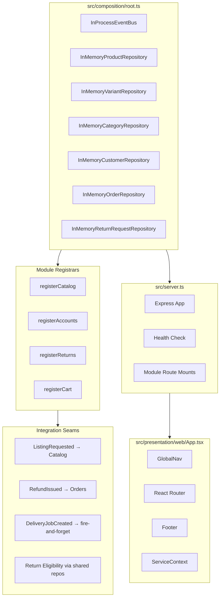
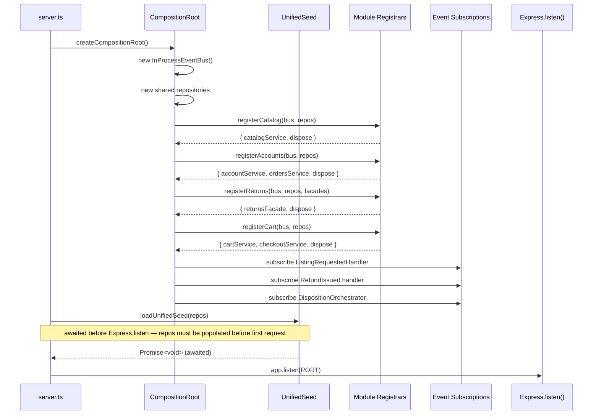
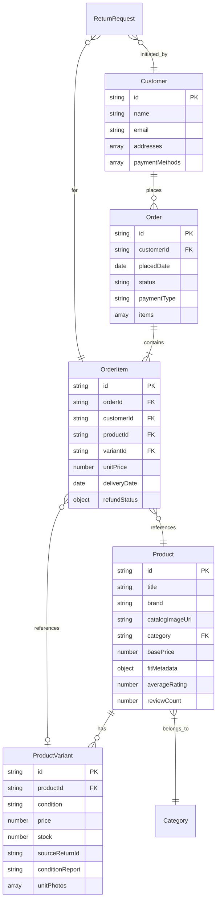

# Design Document: Integration Wiring

## Overview

This feature wires four pre-built modules — Zero-Touch Returns, Storefront Browsing/Catalog, Accounts & Orders, and Cart & Checkout — into a single running application. The integration adds only wiring code: a composition root, unified seed, shared Express entry point, unified React frontend, and cross-module event subscriptions.

No module internals are modified. Modules communicate through a single `InProcessEventBus` instance and shared repository references, with the composition root as the sole orchestrator of instantiation and dependency injection.

### Key Design Decisions

1. **Single Composition Root** — All shared infrastructure (event bus, repositories) is instantiated in one file (`src/composition/root.ts`), replacing the current per-module container approach.
2. **Module Registrar Pattern** — Each module exports a registration function that accepts shared dependencies and returns its public facade. This preserves testability and enforces module boundaries.
3. **Deterministic Registration Order** — Catalog → Accounts → Returns → Cart ensures each registrar can safely depend on facades from previously-registered modules.
4. **Unified Seed with Upsert Semantics** — A single seed loader produces coherent cross-module demo data idempotently.
5. **Layout-Based Routing** — The frontend uses React Router's nested layout pattern so GlobalNav/Footer persist across navigations without remounting.

## Architecture



### Startup Sequence



## Components and Interfaces

### 1. Composition Root (`src/composition/root.ts`)

```typescript
// ─── Shared Infrastructure ───────────────────────────────────────────────────

export interface CompositionResult {
  eventBus: IEventBus;
  catalogModule: CatalogModuleResult;
  accountsModule: AccountsModuleResult;
  returnsModule: ReturnsModuleResult;
  cartModule: CartModuleResult;
  dispose: () => void;
}

export function createCompositionRoot(): CompositionResult;
```

**Responsibilities:**
- Instantiate exactly one `InProcessEventBus`
- Instantiate exactly one of each shared repository (Product, Variant, Category, Customer, Order, ReturnRequest)
- Call module registrars in order: Catalog → Accounts → Returns → Cart
- Wire cross-module event subscriptions after all registrars complete
- Return a unified result with all facades and a `dispose()` for teardown

### 2. Module Registrar Interfaces

```typescript
// ─── Catalog Module ──────────────────────────────────────────────────────────

export interface CatalogDeps {
  eventBus: IEventBus;
  productRepository: IProductRepository;
  variantRepository: IVariantRepository;
  categoryRepository: ICategoryRepository;
}

export interface CatalogModuleResult {
  catalogService: CatalogService;
  // SearchService must already exist in the Catalog module; do NOT generate a new one — re-export the existing instance
  searchService: SearchService;
  dispose: () => void;
}

export function registerCatalog(deps: CatalogDeps): CatalogModuleResult;

// ─── Accounts Module ─────────────────────────────────────────────────────────

export interface AccountsDeps {
  eventBus: IEventBus;
  customerRepository: ICustomerRepository;
  orderRepository: IOrderRepository;
}

export interface AccountsModuleResult {
  identityService: IdentityService;
  accountService: AccountService;
  ordersService: IOrdersService;
  dispose: () => void;
}

export function registerAccounts(deps: AccountsDeps): AccountsModuleResult;

// ─── Returns Module ──────────────────────────────────────────────────────────

export interface ReturnsDeps {
  eventBus: IEventBus;
  returnRequestRepository: IReturnRequestRepository;
  orderRepository: IOrderRepository;
  customerRepository: ICustomerRepository;
  productRepository: IProductRepository;
  // Satisfied by injecting accountsModule.identityService from registerAccounts result — do NOT create a second mock IAuthService for this dependency
  authService: IAuthService;
}

export interface ReturnsModuleResult {
  returnsFacade: IReturnsFacade;
  dispose: () => void;
}

export function registerReturns(deps: ReturnsDeps): ReturnsModuleResult;

// ─── Cart Module ─────────────────────────────────────────────────────────────

export interface CartDeps {
  eventBus: IEventBus;
  orderRepository: IOrderRepository;
  variantRepository: IVariantRepository;
  productRepository: IProductRepository;
  customerRepository: ICustomerRepository;
}

export interface CartModuleResult {
  cartService: ICartService;
  checkoutService: ICheckoutService;
  dispose: () => void;
}

export function registerCart(deps: CartDeps): CartModuleResult;
```

### 3a. Cross-Module Dependency Wiring Note

The composition root resolves cross-module dependencies by passing facades from earlier registrars into later ones:

- `registerReturns` receives `authService: accountsModule.identityService` — the real IdentityService from the Accounts module, sharing the same InMemoryCustomerRepository and InMemoryOrderRepository.

- `registerCart` receives the same `IOrderRepository`, `IProductRepository`, `IVariantRepository`, and `ICustomerRepository` instances used by Catalog and Accounts.

No module registrar imports a concrete class from another module. All cross-module dependencies are satisfied by passing interface-typed values from the composition root.

### 3b. Unified Seed (`src/composition/seed.ts`)

```typescript
// Accepts interfaces not concrete classes — satisfies Dependency Inversion; compatible with both InMemory and DynamoDB adapters.
export interface SeedDeps {
  productRepository: IProductRepository;
  variantRepository: IVariantRepository;
  categoryRepository: ICategoryRepository;
  customerRepository: ICustomerRepository;
  orderRepository: IOrderRepository;
}

/**
 * Idempotent seed loader. Uses upsert semantics so running multiple times
 * produces identical state without duplicates.
 */
export function loadUnifiedSeed(deps: SeedDeps): void;
```

**Seed data produced:**
- 3 categories: Electronics, Footwear, Home
- 6+ products spanning all categories
- Condition variants: New, Open_Box, Certified_Renewed on at least 1 product
- 1 footwear product with fitMetadata (runs_small, offsetMagnitude: 1)
- Price range: at least 1 product < ₹500, at least 1 ≥ ₹500
- 1 demo customer (`demo-customer-1`) with saved address and UPI payment
- 1 delivered order (3 days ago) within the 10-day return window
- `catalogImageUrl` pattern: `/assets/products/{productId}.jpg`
- `averageRating` ∈ [1.0, 5.0], `reviewCount` ∈ [0, 99999]

### 4. Unified Backend Entry Point (`src/server.ts`)

```typescript
export interface ServerOptions {
  port?: number;  // default: process.env.PORT || 3001
}

export function createUnifiedApp(): { app: Express; composition: CompositionResult };
export function startServer(options?: ServerOptions): Promise<http.Server>;
```

**Route mounting:**
| Prefix | Module |
|--------|--------|
| `/api/catalog` | Catalog routes |
| `/api/accounts` | Account routes |
| `/api/orders` | Order routes |
| `/api/returns` | Returns routes |
| `/api/cart` | Cart routes |
| `GET /health` | Health check |

**Health check response:**
```json
{ "status": "ok", "modules": ["catalog", "returns", "accounts", "orders", "cart"] }
```

### 5. Unified React Frontend (`src/presentation/web/App.tsx`)

```typescript
// ─── Service Context ─────────────────────────────────────────────────────────

export interface ServiceContextValue {
  catalogService: CatalogService;
  cartService: ICartService;
  checkoutService: ICheckoutService;
  eventBus: IEventBus;
}

export const ServiceContext = React.createContext<ServiceContextValue | null>(null);

// ─── App Component ───────────────────────────────────────────────────────────

export function App(): JSX.Element;
```

**Route structure:**
| Route | Page |
|-------|------|
| `/` | Home (catalog rails) |
| `/product/:id` | Product detail |
| `/search` | Search results |
| `/category/:id` | Category page |
| `/account` | Account hub |
| `/orders` | Orders list |
| `/orders/:id` | Order detail |
| `/returns/:orderId/:itemId` | Returns flow |
| `/cart` | Cart page |
| `/checkout` | Checkout flow |
| `*` | Not Found page |

**Layout strategy:** A shared `<MainLayout>` wraps all authenticated/catalog routes, rendering GlobalNav and Footer via React Router's `<Outlet>`. Login/Signup routes are outside the layout. GlobalNav contains: home link, search entry point, account link, cart link (with badge).

### 6. Integration Seam Handlers

#### ListingRequested → Catalog

Already implemented as `ListingRequestedHandler`. The composition root subscribes it to the shared bus after all registrars complete. When a Grade-A return is processed:

1. Returns publishes `ListingRequested` event
2. `ListingRequestedHandler` calls `CatalogService.createVariantFromListing()`
3. New `Open_Box` variant created with price = `basePrice × (1 − openBoxDiscountPercent/100)`
4. Variant persisted in shared `InMemoryVariantRepository`

#### RefundIssued → Orders

Already implemented in `OrdersService` constructor (subscribes at construction time). The composition root ensures OrdersService is constructed with the shared event bus:

1. Returns publishes `RefundIssued` with `{ orderItemId, amount, currency, issuedAt }`
2. `OrdersService.handleRefundIssued()` calls `updateRefundStatus()`
3. Order item's `refundStatus` updated to `{ code: 'refund_issued', amount, currency, issuedAt }`

#### DeliveryJobCreated (fire-and-forget)

No subscriber exists yet (FlexRoute module not implemented). The `InProcessEventBus` silently discards events with no subscribers (returns immediately from `publish()` when no handlers are registered). No special wiring needed.

#### Return Eligibility via Shared Repos

The Returns module's `ReturnsFacade` and `ReturnEligibilityService` read from shared `InMemoryOrderRepository`, `InMemoryProductRepository`, and `InMemoryCustomerRepository` — the same instances written to by Catalog, Accounts, and Cart modules. No event is needed; shared references provide immediate read consistency.

### 7. Integration Smoke Tests (`src/integration/smoke.test.ts`)

```typescript
describe('Integration Smoke Tests', () => {
  let composition: CompositionResult;

  beforeAll(() => {
    composition = createCompositionRoot();
    loadUnifiedSeed(/* repos from composition */);
  });

  afterAll(() => {
    composition.dispose();
  });

  it('return eligibility reads from shared order repo');
  it('product image comes from shared catalog repo');
  it('ListingRequested creates Open_Box variant');
  it('RefundIssued updates order item status');
  it('created variant appears in product detail variants list');
});
```

## Data Models

### Cross-Module Shared Data (managed by Composition Root)



### Event Payloads (cross-module seam contracts)

```typescript
// ListingRequested (Returns → Catalog)
interface ListingRequestedPayload {
  returnRequestId: string;
  productId: string;
  conditionGrade: ConditionGrade;  // 'A' triggers Open_Box creation
  assessmentSummary: string;
  mediaReferences: MediaReference[];
}

// RefundIssued (Returns → Orders)
interface RefundIssuedPayload {
  orderItemId: string;
  returnRequestId: string;
  amount: number;
  currency: string;
  issuedAt: string;  // ISO 8601
}

// DeliveryJobCreated (Returns → future Logistics)
interface DeliveryJobCreatedPayload {
  returnRequestId: string;
  pickupAddress: string;
  dropAddress: string;
  itemId: string;
  priority: 'standard' | 'urgent';
}

// DispositionDecisionMade (Returns internal → DispositionOrchestrator → ListingRequested or RefundIssued)
// The DispositionOrchestrator subscribes to this event, which the Returns module publishes
// after the AI grading step completes. It then decides which downstream events to emit.
interface DispositionDecisionMadePayload {
  returnRequestId: string;
  productId: string;
  conditionGrade: ConditionGrade;       // 'A' | 'B' | 'C' | 'D'
  dispositionAction: 'relist' | 'refurb' | 'returnless_refund' | 'warehouse';
  assessmentSummary: string;
  mediaReferences: MediaReference[];
  orderItemId: string;
  refundAmount: number;
  currency: string;
}
// DispositionOrchestrator: if dispositionAction === 'relist', publishes ListingRequested.
// For all non-fraud dispositions, publishes RefundIssued.
```

## Correctness Properties

*A property is a characteristic or behavior that should hold true across all valid executions of a system — essentially, a formal statement about what the system should do. Properties serve as the bridge between human-readable specifications and machine-verifiable correctness guarantees.*

### Property 1: Event bus delivers to all subscribers and awaits completion

*For any* domain event and *for any* set of N registered handlers for that event's type, publishing the event SHALL invoke all N handlers, and the publish() Promise SHALL not resolve until every handler's returned Promise has settled.

**Validates: Requirements 1.3**

### Property 2: Error isolation — throwing handlers do not affect others

*For any* domain event and *for any* set of N registered handlers where K handlers (0 ≤ K ≤ N) throw errors, the remaining N−K handlers SHALL still be invoked and complete, and the publish() call SHALL resolve without throwing to the publisher.

**Validates: Requirements 1.5, 10.3**

### Property 3: Seed idempotence

*For any* number of invocations N ≥ 1 of `loadUnifiedSeed()` on the same repository instances, the repository state after N invocations SHALL be identical to the state after exactly 1 invocation (same entity count, same entity data, no duplicates).

**Validates: Requirements 4.11**

### Property 4: Open_Box variant pricing invariant

*For any* product with basePrice > 0 and *for any* openBoxDiscountPercent ∈ (0, 100), when a ListingRequested event with conditionGrade 'A' is processed for that product, the resulting Open_Box variant's price SHALL equal `basePrice × (1 − openBoxDiscountPercent / 100)`.

**Validates: Requirements 7.2**

### Property 5: ListingRequested idempotent handling

*For any* valid ListingRequested event published N times (N ≥ 1) with the same returnRequestId, the system SHALL create exactly one Open_Box variant. All subsequent publications with the same returnRequestId SHALL be discarded without creating duplicates.

**Validates: Requirements 7.5**

### Property 6: RefundIssued correctly updates order item status

*For any* valid RefundIssued event with amount > 0, a valid currency string, and a valid issuedAt timestamp, publishing that event SHALL result in the referenced order item's refundStatus being set to `{ code: 'refund_issued', amount, currency, issuedAt }`.

**Validates: Requirements 8.1**

### Property 7: RefundIssued idempotent handling

*For any* RefundIssued event published N times (N ≥ 1) for the same orderItemId, the order item's refundStatus after N publications SHALL be identical to the status after exactly 1 publication.

**Validates: Requirements 8.4**

### Property 8: Cross-module repository visibility

*For any* entity (product, customer, or order) written to a shared repository by one module, any other module holding a reference to the same repository instance SHALL observe that entity on its next read, without requiring restart or reinitialization.

**Validates: Requirements 9.6**

## Error Handling

### Startup Errors

| Error Scenario | Behavior |
|---|---|
| Module registrar throws | Halt startup, propagate error, do not start Express |
| Seed data loader throws | Log which seed step failed, exit process with non-zero code |
| Missing shared dependency at resolve time | Throw descriptive error naming the missing dependency and requesting module |
| `ZTR_BEDROCK_ENABLED=true` without AWS credentials | Fail startup with credential-missing error message |

### Runtime Errors

| Error Scenario | Behavior |
|---|---|
| Event subscriber throws | Log error with eventId + eventType, continue delivering to remaining subscribers, do not propagate to publisher |
| ListingRequested for non-existent productId | Log warning with discardReason: 'unknown_productId' and the missing productId value, then discard without throwing |
| ListingRequested duplicate (same returnRequestId) | Log info (discardReason: 'duplicate'), discard silently |
| RefundIssued for non-existent orderItemId | Log warning, discard without throwing |
| Return eligibility for missing product/customer/order | Return ineligible result with error message naming the missing entity |
| DeliveryJobCreated with no subscriber | Silent discard (no error, no warning) — intentional for future module |
| Unmatched frontend route | Render NotFound page with link to home |

### Error Recovery Principles

- **Never crash the app for a single event failure** — isolate errors per-subscriber
- **Idempotent handling everywhere** — duplicate events are expected and safe
- **Fail-fast at startup, fail-graceful at runtime** — composition errors halt the process; runtime errors are logged and contained
- **No silent data loss** — every discarded event is logged with a reason

## Testing Strategy

### Unit Tests

- Each module registrar: verify it returns correct interfaces and dispose function
- Composition root: verify singleton instances (reference equality), registration order, error propagation
- Unified seed: verify all data shape requirements (products, categories, customer, order, variants)
- Route mounting: verify all API prefixes respond correctly via supertest

### Property-Based Tests (fast-check, min 100 iterations)

Property-based testing is appropriate for this feature because the event bus, seed idempotence, and event-handler correctness all have universal properties that hold across wide input ranges.

**Library:** `fast-check` (already in devDependencies)
**Configuration:** Minimum 100 iterations per property test
**Tag format:** `Feature: integration-wiring, Property {number}: {title}`

| Property | What It Tests | Generator Strategy |
|---|---|---|
| 1. Event delivery completeness | All handlers called and awaited | Generate random handler counts (1-20), random events |
| 2. Error isolation | Throwing handlers don't affect others | Generate handler arrays with random throw positions |
| 3. Seed idempotence | Multiple runs = single run | Generate random invocation count (1-10) |
| 4. Open_Box pricing | Price = basePrice × (1 − discount/100) | Generate random basePrices and discount percentages |
| 5. ListingRequested idempotence | Duplicate events create one variant | Generate random valid events, publish 1-5 times |
| 6. RefundIssued correctness | Status updated with exact payload values | Generate random amounts, currencies, timestamps |
| 7. RefundIssued idempotence | Duplicate events don't modify state | Generate random events, publish 1-5 times |
| 8. Cross-module repo visibility | Write-then-read consistency | Generate random entities, write via one reference, read via another |

### Integration Smoke Tests

A dedicated test file (`src/integration/smoke.test.ts`) verifies the five cross-module seams end-to-end:

1. Return eligibility reads real order data from shared repo
2. Product image URL matches between catalog repo and eligibility result
3. ListingRequested event creates Open_Box variant in catalog
4. RefundIssued event updates order item status
5. Created variant appears in product detail query

### Architectural Boundary Tests

Static import-graph analysis to verify:
- Only `src/composition/root.ts` imports concrete infrastructure classes
- No module under `src/application/` imports another module's non-barrel-exported files
- Each module's `index.ts` exports only facades and public types
