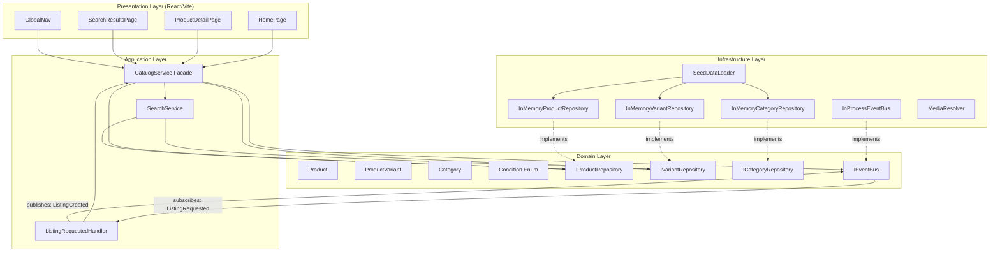
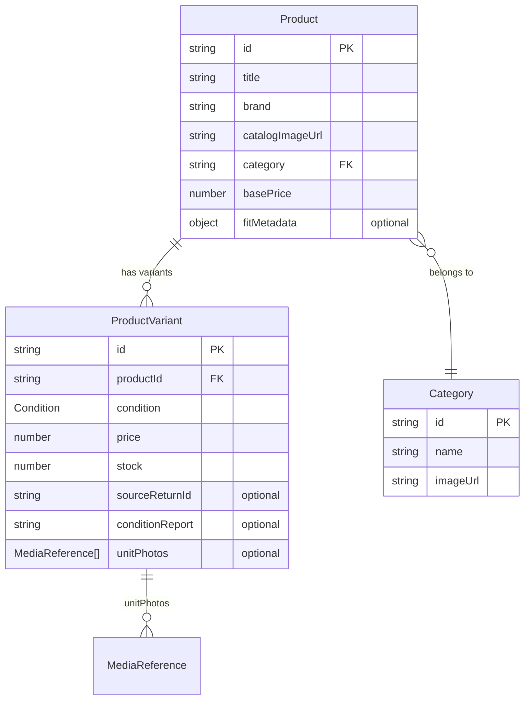

# Design Document: Storefront Browsing

## Overview

The Storefront Browsing module is the public-facing catalog, search, and home surface of the Second Life Commerce platform. It provides customers with an Amazon-like product discovery experience featuring condition-variant pricing (New, Certified Renewed, Open Box, Used-Like New) on each Product Detail Page. The module subscribes to `ListingRequested` domain events from the Returns module and creates second-life `ProductVariant` entries — closing the "returned item reappears for sale" loop visible during demo.

The module exposes a `CatalogService` facade as the single application-layer entry point. All data access goes through `IProductRepository` and `IVariantRepository` interfaces, with in-memory implementations for the demo and DynamoDB adapters as stretch. The module follows the project's layered architecture (Presentation → Application → Domain ← Infrastructure) and communicates with other modules exclusively through the shared event bus and facade interfaces.

**Key design goals:**
- Credible Amazon-like storefront that "looks real" as the first thing a judge sees
- Condition variants on PDP showing the second-life loop (returned items reappearing for sale)
- Event-driven ingestion of graded returns into sellable listings
- Runs fully locally with in-memory data and no AWS credentials
- Clean separation of concerns enabling the Returns module to consume catalog data without coupling

## Architecture



### Layer Responsibilities

| Layer | Responsibility | Key Types |
|-------|---------------|-----------|
| **Presentation** | React components, routing, media resolution, user interaction | HomePage, PDP, SearchResultsPage, GlobalNav |
| **Application** | Use-case orchestration, facade API, event handling, search logic | CatalogService, SearchService (internal, delegated from facade), ListingRequestedHandler |
| **Domain** | Entities, value objects, repository interfaces, business rules | Product, ProductVariant, Category, Condition, IProductRepository, IVariantRepository |
| **Infrastructure** | In-memory repos, event bus wiring, seed data loading, media URL resolution | InMemoryProductRepository, InMemoryVariantRepository, SeedDataLoader, MediaResolver |

### Module Boundary

The Catalog module boundary is enforced as follows:
- **Exposes:** `CatalogService` facade (the only entry point for other modules and the presentation layer)
- **Subscribes to:** `ListingRequested` event from the Returns module via IEventBus
- **Publishes:** `ListingCreated` event on successful variant creation
- **No other module imports Catalog internals** — all access goes through the facade or events

## Components and Interfaces

### Domain Entities

```typescript
// src/domain/catalog/Product.ts

export interface FitMetadata {
  sizeOffsetIndicator: 'runs_small' | 'runs_large' | 'true_to_size';
  offsetMagnitude: number; // e.g., 1 = one size off
}

export interface ProductProps {
  id: string;
  title: string;
  brand: string;
  catalogImageUrl: string;
  category: string; // category ID reference
  basePrice: number; // in ₹
  fitMetadata?: FitMetadata;
}

export class Product {
  private readonly _props: Readonly<ProductProps>;

  constructor(props: ProductProps) {
    this._props = Object.freeze({ ...props });
  }

  get id(): string { return this._props.id; }
  get title(): string { return this._props.title; }
  get brand(): string { return this._props.brand; }
  get catalogImageUrl(): string { return this._props.catalogImageUrl; }
  get category(): string { return this._props.category; }
  get basePrice(): number { return this._props.basePrice; }
  get fitMetadata(): FitMetadata | undefined { return this._props.fitMetadata; }

  toProps(): ProductProps { return { ...this._props }; }
}
```

```typescript
// src/domain/catalog/ProductVariant.ts

import type { MediaReference } from '../shared/types.js';

export type Condition = 'New' | 'Certified_Renewed' | 'Open_Box' | 'Used_Like_New';

export interface ProductVariantProps {
  id: string;
  productId: string;
  condition: Condition;
  price: number; // in ₹
  stock: number;
  sourceReturnId?: string;
  conditionReport?: string; // plain text from AI assessment
  unitPhotos?: MediaReference[]; // resolved to displayable URLs by presentation layer
}

export class ProductVariant {
  private readonly _props: Readonly<ProductVariantProps>;

  constructor(props: ProductVariantProps) {
    this._props = Object.freeze({ ...props });
  }

  get id(): string { return this._props.id; }
  get productId(): string { return this._props.productId; }
  get condition(): Condition { return this._props.condition; }
  get price(): number { return this._props.price; }
  get stock(): number { return this._props.stock; }
  get sourceReturnId(): string | undefined { return this._props.sourceReturnId; }
  get conditionReport(): string | undefined { return this._props.conditionReport; }
  get unitPhotos(): MediaReference[] | undefined {
    return this._props.unitPhotos ? [...this._props.unitPhotos] : undefined;
  }

  get isSecondLife(): boolean {
    return this.sourceReturnId !== undefined;
  }

  get isInStock(): boolean {
    return this.stock > 0;
  }

  toProps(): ProductVariantProps { return { ...this._props }; }
}
```

```typescript
// src/domain/catalog/Category.ts

export interface CategoryProps {
  id: string;
  name: string;
  imageUrl: string;
}

export class Category {
  private readonly _props: Readonly<CategoryProps>;

  constructor(props: CategoryProps) {
    this._props = Object.freeze({ ...props });
  }

  get id(): string { return this._props.id; }
  get name(): string { return this._props.name; }
  get imageUrl(): string { return this._props.imageUrl; }

  toProps(): CategoryProps { return { ...this._props }; }
}
```

### Repository Interfaces

```typescript
// src/domain/catalog/IProductRepository.ts

import type { Product } from './Product.js';

export interface IProductRepository {
  findById(id: string): Promise<Product | null>;
  findByCategory(categoryId: string): Promise<Product[]>;
  searchByKeyword(keyword: string, limit?: number): Promise<Product[]>; // default limit: 50
  findAll(limit?: number): Promise<Product[]>; // default limit: 100
}
```

```typescript
// src/domain/catalog/IVariantRepository.ts

import type { ProductVariant } from './ProductVariant.js';
import type { Condition } from './ProductVariant.js';

export interface IVariantRepository {
  findByProductId(productId: string): Promise<ProductVariant[]>;
  findById(id: string): Promise<ProductVariant | null>;
  save(variant: ProductVariant): Promise<void>;
  findByCondition(condition: Condition): Promise<ProductVariant[]>;
  findBySourceReturnId(sourceReturnId: string): Promise<ProductVariant | null>;
}
```

```typescript
// src/domain/catalog/ICategoryRepository.ts

import type { Category } from './Category.js';

export interface ICategoryRepository {
  findAll(): Promise<Category[]>;
  findById(id: string): Promise<Category | null>;
}
```

### CatalogService Facade

```typescript
// src/application/catalog/CatalogService.ts

import type { Product } from '../../domain/catalog/Product.js';
import type { ProductVariant, Condition } from '../../domain/catalog/ProductVariant.js';
import type { Category } from '../../domain/catalog/Category.js';
import type { IProductRepository } from '../../domain/catalog/IProductRepository.js';
import type { IVariantRepository } from '../../domain/catalog/IVariantRepository.js';
import type { ICategoryRepository } from '../../domain/catalog/ICategoryRepository.js';
import type { IEventBus } from '../../domain/shared/events.js';

export interface CatalogError {
  type: 'validation' | 'not_found' | 'duplicate' | 'invalid_grade';
  field: string;
  message: string;
}

export interface ListingRequestPayload {
  returnRequestId: string;
  productId: string;
  conditionGrade: string;
  assessmentSummary: string;
  mediaReferences: MediaReference[];
}

export type CatalogResult<T> = { success: true; data: T } | { success: false; error: CatalogError };

export class CatalogService {
  constructor(
    private readonly productRepo: IProductRepository,
    private readonly variantRepo: IVariantRepository,
    private readonly categoryRepo: ICategoryRepository,
    private readonly eventBus: IEventBus,
    private readonly config: CatalogConfig
  ) {}

  async getProductById(id: string): Promise<Product | null>;
  async getVariantsByProductId(productId: string): Promise<ProductVariant[]>;
  async searchProducts(keyword: string, options?: SearchOptions): Promise<SearchResult>;
  async getCategories(): Promise<Category[]>;
  async createVariantFromListing(payload: ListingRequestPayload): Promise<CatalogResult<ProductVariant>>;
  async getDeliveryEstimate(): Promise<DeliveryEstimate>;
}
```

### Delivery Estimate

The delivery estimate on the PDP (R1.1) is computed via a simple configurable offset from today's date. No external shipping API is required for the demo — it's a static range (e.g., "2–4 days from now") rendered by the presentation layer.

```typescript
// src/application/catalog/DeliveryEstimate.ts

export interface DeliveryEstimate {
  earliestDate: string;  // ISO date string, e.g., "2026-06-18"
  latestDate: string;    // ISO date string, e.g., "2026-06-20"
  displayText: string;   // e.g., "Delivery by Jun 18–20"
}

// Default config: minDays = 2, maxDays = 4 from current date
```
```

### SearchService

The `SearchService` is an **internal** application-layer service. The presentation layer does NOT call it directly — all access goes through `CatalogService.searchProducts()` which delegates to SearchService internally. This preserves the single-entry-point facade contract (R6.1).

```typescript
// src/application/catalog/SearchService.ts

export interface SearchOptions {
  filters?: SearchFilters;
  sort?: SortOption;
  page?: number;       // 1-based, default 1
  pageSize?: number;   // default 20
}

export interface SearchFilters {
  priceMin?: number;
  priceMax?: number;
  brands?: string[];
  minRating?: number;
  conditions?: Condition[];
}

export type SortOption = 'relevance' | 'price_asc' | 'price_desc' | 'rating_desc';

export interface SearchResult {
  products: ProductSearchCard[];
  totalCount: number;
  page: number;
  pageSize: number;
  totalPages: number;
}

export interface ProductSearchCard {
  id: string;
  title: string;
  brand: string;
  thumbnailUrl: string;
  lowestPrice: number;        // lowest price among in-stock variants
  averageRating: number | null;
  reviewCount: number;
  isOutOfStock: boolean;      // true if ALL variants have stock = 0
  hasSecondLife: boolean;     // true if any variant has sourceReturnId
}
```

### ListingRequested Event Handler

```typescript
// src/application/catalog/ListingRequestedHandler.ts

import type { DomainEvent, IEventBus } from '../../domain/shared/events.js';
import type { CatalogService } from './CatalogService.js';
import type { ILogger } from '../../domain/shared/ILogger.js';

export class ListingRequestedHandler {
  constructor(
    private readonly catalogService: CatalogService,
    private readonly eventBus: IEventBus,
    private readonly logger: ILogger
  ) {
    this.eventBus.subscribe('ListingRequested', this.handle.bind(this));
  }

  async handle(event: DomainEvent): Promise<void> {
    // 1. Validate required fields present and well-typed
    // 2. Reject non-A grades (log + discard)
    // 3. Check idempotency (existing variant with same sourceReturnId)
    // 4. Delegate to CatalogService.createVariantFromListing
    // 5. On success: publish ListingCreated
    // 6. On failure: log structured error, do NOT throw
  }
}
```

### Configuration

```typescript
// src/application/catalog/CatalogConfig.ts

export interface CatalogConfig {
  /** Discount percentage for Open_Box variants created from returns (default: 15) */
  openBoxDiscountPercent: number;
  /** Discount percentage for Certified_Renewed variants (default: 25) */
  certifiedRenewedDiscountPercent: number;
  /** Maximum number of unit photos stored per variant (default: 10) */
  maxUnitPhotos: number;
  /** Returnless refund threshold in ₹ (default: 500) */
  returnlessRefundThreshold: number;
  /** Maximum autocomplete suggestions (default: 8) */
  maxAutocompleteSuggestions: number;
  /** Search results per page (default: 20) */
  searchPageSize: number;
  /** Maximum deals rail items (default: 10) */
  maxDealsRailItems: number;
  /** Maximum second life rail items (default: 10) */
  maxSecondLifeRailItems: number;
  /** Maximum category tiles on home page (default: 12) */
  maxCategoryTiles: number;
  /** Minimum delivery days from today (default: 2) */
  deliveryMinDays: number;
  /** Maximum delivery days from today (default: 4) */
  deliveryMaxDays: number;
}

export const DEFAULT_CATALOG_CONFIG: CatalogConfig = {
  openBoxDiscountPercent: 15,
  certifiedRenewedDiscountPercent: 25,
  maxUnitPhotos: 10,
  returnlessRefundThreshold: 500,
  maxAutocompleteSuggestions: 8,
  searchPageSize: 20,
  maxDealsRailItems: 10,
  maxSecondLifeRailItems: 10,
  maxCategoryTiles: 12,
  deliveryMinDays: 2,
  deliveryMaxDays: 4,
};
```

### Media Resolution

The presentation layer resolves `MediaReference[]` (stored as storage keys) to displayable image URLs via a `MediaResolver` adapter:

```typescript
// src/infrastructure/catalog/IMediaResolver.ts

export interface IMediaResolver {
  /**
   * Resolves a MediaReference storageKey to a displayable URL.
   * In local/demo mode: maps to /assets/uploads/{storageKey}
   * In production: generates S3 presigned URL or CloudFront URL
   */
  resolveUrl(storageKey: string): string;
}

// src/infrastructure/catalog/LocalMediaResolver.ts
export class LocalMediaResolver implements IMediaResolver {
  resolveUrl(storageKey: string): string {
    return `/assets/uploads/${storageKey}`;
  }
}

// src/infrastructure/catalog/S3MediaResolver.ts (stretch)
export class S3MediaResolver implements IMediaResolver {
  constructor(private readonly bucketName: string, private readonly region: string) {}
  resolveUrl(storageKey: string): string {
    return `https://${this.bucketName}.s3.${this.region}.amazonaws.com/${storageKey}`;
  }
}
```

## Data Models

### Entity Relationship



### In-Memory Storage Schema

```typescript
// InMemoryProductRepository stores: Map<productId, Product>
// InMemoryVariantRepository stores: Map<variantId, ProductVariant>
//   with secondary index: Map<productId, variantId[]> for fast lookup
// InMemoryCategoryRepository stores: Map<categoryId, Category>
```

### Domain Events (Catalog-specific)

```typescript
// ListingCreated event published by this module
export interface ListingCreatedEvent extends DomainEvent {
  eventType: 'ListingCreated';
  payload: {
    variantId: string;
    productId: string;
    condition: Condition;
    sourceReturnId: string;
    price: number;
  };
}
```

## Correctness Properties

*A property is a characteristic or behavior that should hold true across all valid executions of a system — essentially, a formal statement about what the system should do. Properties serve as the bridge between human-readable specifications and machine-verifiable correctness guarantees.*

### Property 1: Buy button state reflects variant stock availability

*For any* Product with one or more ProductVariants, the "Add to Cart" and "Buy Now" buttons SHALL be enabled if and only if at least one variant has stock greater than zero; when all variants have stock equal to zero, both buttons SHALL be disabled.

**Validates: Requirements 1.3, 8.2**

### Property 2: Condition selector is ordered by price ascending

*For any* Product with multiple ProductVariants, the condition selector SHALL list variants in ascending order of price (lowest first).

**Validates: Requirements 2.1**

### Property 3: Second Life UI elements rendered based on variant metadata presence

*For any* ProductVariant, the "Second Life" badge SHALL be displayed if and only if `sourceReturnId` is present. The condition report text SHALL be displayed if and only if both `sourceReturnId` and `conditionReport` are present. The unit photo thumbnail gallery SHALL be displayed if and only if `sourceReturnId` is present AND `unitPhotos` is a non-empty array.

**Validates: Requirements 2.3, 2.4**

### Property 4: Default variant selection is lowest-priced in-stock

*For any* Product with one or more in-stock variants, when the PDP loads the initially selected variant SHALL be the variant with the lowest price among those with stock greater than zero.

**Validates: Requirements 2.7**

### Property 5: Valid Grade A ListingRequested creates correct variant and publishes ListingCreated

*For any* valid `ListingRequested` event with `conditionGrade` equal to "A" and a `productId` that exists in the catalog, the system SHALL create a `ProductVariant` with condition `Open_Box`, price equal to `basePrice * (1 - openBoxDiscountPercent/100)`, stock equal to 1, `sourceReturnId` set to the event's `returnRequestId`, `conditionReport` set to the event's `assessmentSummary`, and `unitPhotos` populated from the event's `mediaReferences` (capped at `maxUnitPhotos`), AND SHALL publish a `ListingCreated` event with the correct variant ID, product ID, condition, and sourceReturnId.

**Validates: Requirements 3.1, 3.2, 6.7**

### Property 6: Unknown productId in ListingRequested results in graceful discard

*For any* `ListingRequested` event whose `productId` does not match any Product in the repository, the system SHALL discard the event without creating a variant, without publishing `ListingCreated`, without throwing an exception, and SHALL emit a structured warning log containing the eventId, returnRequestId, productId, and discardReason.

**Validates: Requirements 3.3, 10.1, 10.2, 10.3, 10.4**

### Property 7: Non-A grade ListingRequested is discarded

*For any* `ListingRequested` event with a `conditionGrade` value that is not "A" (including "B", "C", "D", null, empty, or any unrecognized value), the system SHALL discard the event without creating a variant and without publishing `ListingCreated`.

**Validates: Requirements 3.4**

### Property 8: Idempotent ListingRequested processing

*For any* `ListingRequested` event, if a ProductVariant with the same `sourceReturnId` already exists for the referenced `productId`, the system SHALL skip creation (no duplicate variant produced) and log an informational message.

**Validates: Requirements 3.6**

### Property 9: Malformed ListingRequested events are discarded with error log

*For any* `ListingRequested` event where any required field (returnRequestId, productId, conditionGrade, assessmentSummary, mediaReferences) is null, empty, or not of the expected type, the system SHALL discard the event without creating a variant, without publishing `ListingCreated`, and SHALL log a structured error identifying the invalid field.

**Validates: Requirements 3.7**

### Property 10: Search returns matching products via case-insensitive substring

*For any* non-empty search keyword and any Product in the catalog, the Product SHALL appear in search results if and only if the keyword is a case-insensitive substring of the Product's title, brand, or category name.

**Validates: Requirements 4.3, 4.8**

### Property 11: Search sort produces correctly ordered results

*For any* set of search results, when sorted by `price_asc` the results SHALL be in non-decreasing order of lowest in-stock variant price; when sorted by `price_desc` the results SHALL be in non-increasing order; when sorted by `rating_desc` the results SHALL be in non-increasing order of average rating.

**Validates: Requirements 4.5**

### Property 12: Search filters return only products satisfying all active criteria

*For any* set of active filters (price range, brands, minimum rating, conditions), all products in the filtered results SHALL satisfy every active filter simultaneously. No product violating any active filter SHALL appear in results.

**Validates: Requirements 4.6**

### Property 13: Deals rail contains only discounted variants

*For any* catalog state, the Deals rail SHALL contain only ProductVariants whose price is strictly less than their parent Product's basePrice, with a maximum of 10 items.

**Validates: Requirements 5.3**

### Property 14: Second Life rail contains only Open_Box or Certified_Renewed variants

*For any* catalog state, the "Second Life / Renewed" rail SHALL contain only ProductVariants with condition `Open_Box` or `Certified_Renewed`, with a maximum of 10 items.

**Validates: Requirements 5.4**

### Property 15: CatalogService validates inputs and returns structured errors

*For any* invalid input to CatalogService methods (empty IDs, invalid condition enum values, negative prices), the service SHALL return a descriptive error object with `type`, `field`, and `message` properties rather than throwing an unhandled exception. For not-found cases, the service SHALL return null.

**Validates: Requirements 6.6**

### Property 16: Auto-switch selected variant on stock depletion

*For any* PDP state where the currently selected variant's stock transitions to zero, the system SHALL automatically switch the selection to the next lowest-priced in-stock variant if one exists, or disable purchase buttons if no in-stock variant remains.

**Validates: Requirements 8.3**

### Property 17: Out-of-stock products sorted after in-stock in default relevance sort

*For any* search result set using the default relevance sort, all products where every variant has stock equal to zero SHALL appear after all products with at least one in-stock variant.

**Validates: Requirements 8.4**

## Error Handling

### Error Strategy by Layer

| Layer | Strategy | Example |
|-------|----------|---------|
| **Domain** | Validate invariants at construction time; throw only for programming errors (assertions) | Product with empty title → rejected at factory |
| **Application (CatalogService)** | Return `CatalogResult<T>` with structured `CatalogError` — never throw for expected failures | Unknown product ID → `{ success: false, error: { type: 'not_found', field: 'productId', message: '...' } }` |
| **Application (Event Handler)** | Catch all errors, log structured warning/error, return successfully (never crash the handler) | Malformed event → log error, discard, continue |
| **Presentation** | Display user-friendly messages; never show raw errors; provide recovery actions | Network failure → "Something went wrong — please try again" + retry link |

### Specific Error Scenarios

1. **Product not found (PDP):** Display "This product could not be found" with home page link
2. **Network failure (PDP):** Display "Something went wrong — please try again" with retry button
3. **ListingRequested with unknown product:** Log structured warning, discard silently
4. **ListingRequested with invalid grade:** Log structured info, discard silently
5. **ListingRequested duplicate (idempotency):** Log info message, skip creation, return success
6. **ListingRequested malformed fields:** Log structured error with field name, discard
7. **Search with empty query:** No-op, retain focus on search input
8. **Add to cart race condition (stock depleted):** Reject, show inline notification, refresh PDP state

### Structured Log Schema

```typescript
interface CatalogLogEntry {
  timestamp: string;        // ISO 8601
  level: 'info' | 'warn' | 'error';
  module: 'catalog';
  action: string;           // e.g., 'listing_requested_discard'
  eventId?: string;
  returnRequestId?: string;
  productId?: string;
  discardReason?: string;   // e.g., 'unknown_productId', 'invalid_grade', 'duplicate', 'malformed_field'
  invalidField?: string;    // which field failed validation
  message: string;
}
```

## Testing Strategy

### Dual Testing Approach

This module is well-suited for property-based testing because it contains pure business logic (search, filtering, sorting, event processing, variant creation) with clear input/output behavior and universal properties that hold across a wide input space.

**Property-Based Testing (PBT):**
- Library: `fast-check` (already in devDependencies)
- Minimum 100 iterations per property test
- Each test tagged with: `Feature: storefront-browsing, Property {N}: {title}`
- Focus areas: search algorithm, filter logic, sort correctness, event handler validation, variant creation logic, stock-derived UI state

**Unit Tests (Example-Based):**
- Framework: `vitest` (already configured)
- Focus: specific rendering scenarios, edge cases, error paths, seed data validation
- Smoke tests for facade API surface, repository interface compliance, seed data integrity

### Test Organization

```
src/
├── domain/catalog/
│   ├── Product.test.ts                    # Entity construction, invariants
│   └── ProductVariant.test.ts             # Entity construction, isSecondLife/isInStock
├── application/catalog/
│   ├── CatalogService.test.ts             # Unit tests for facade methods
│   ├── CatalogService.property.test.ts    # Properties 5, 6, 7, 8, 9, 15
│   ├── SearchService.test.ts              # Unit tests for edge cases
│   ├── SearchService.property.test.ts     # Properties 10, 11, 12, 17
│   └── ListingRequestedHandler.test.ts    # Unit tests for event handling
├── infrastructure/catalog/
│   ├── InMemoryProductRepository.test.ts  # Repository contract tests
│   ├── InMemoryVariantRepository.test.ts  # Repository contract tests
│   └── SeedDataLoader.test.ts             # Smoke tests for seed integrity
└── presentation/web/catalog/
    ├── PDP.test.tsx                        # Properties 1, 2, 3, 4, 16 (component logic)
    └── HomeRails.test.tsx                  # Properties 13, 14
```

### Property Test Configuration

- Each property test runs a **minimum of 100 iterations**
- Generators produce random Products, ProductVariants, Categories, search queries, and ListingRequested events
- Edge cases (empty strings, zero stock, boundary prices, max-length queries) are covered by generators via `fc.oneof` mixing edge values with random values
- All property tests reference their design document property number in a tag comment

### What Is NOT Tested with PBT

- UI rendering fidelity (use snapshot/visual regression tests)
- WCAG compliance (manual + automated accessibility audits)
- Performance constraints (2s load, 200ms update, 300ms autocomplete — use performance benchmarks)
- Seed data content (smoke tests with assertions)
- Responsive breakpoints (visual regression tests)

### Presentation Layer Component Hierarchy

```
<App>
├── <GlobalNav>
│   ├── <Logo />
│   ├── <SearchBar />           ← autocomplete dropdown
│   ├── <CategoryMenu />
│   ├── <AccountIcon />
│   └── <CartIcon badge={count} />
├── <Routes>
│   ├── <HomePage>
│   │   ├── <CategoryTiles categories={[]} />
│   │   ├── <DealsRail variants={[]} />
│   │   └── <SecondLifeRail variants={[]} />
│   ├── <ProductDetailPage productId={id}>
│   │   ├── <ImageGallery images={[]} />
│   │   ├── <ProductInfo title brand price rating />
│   │   ├── <ConditionSelector variants={[]} onSelect />
│   │   ├── <SecondLifeDetails report photos badge />
│   │   └── <PurchaseActions addToCart buyNow disabled />
│   ├── <SearchResultsPage query={q}>
│   │   ├── <FilterPanel filters onChange />
│   │   ├── <SortSelector sort onChange />
│   │   ├── <ProductGrid products={[]} />
│   │   ├── <Pagination page totalPages />
│   │   └── <NoResults query suggestions />
│   └── <CategoryPage categoryId={id} />
└── <Footer />
```

### Seed Data Loading Strategy

Seed data is loaded synchronously during application bootstrap, before the HTTP server starts accepting requests or the React app renders:

1. **Composition root** calls `SeedDataLoader.load(productRepo, variantRepo, categoryRepo)`
2. Loader creates Category entities first (referenced by Products)
3. Loader creates Product entities with `catalogImageUrl` following pattern `/assets/products/{productId}.jpg`
4. Loader creates ProductVariant entities (including multi-condition variants for demo products)
5. All repositories are populated before the event bus starts processing or the server listens

Seed data includes:
- 6+ products across Electronics, Footwear, Home (and optionally Clothing, Sports, Books)
- At least 1 product with New + Open_Box + Certified_Renewed variants (the demo showpiece)
- At least 1 footwear product with `fitMetadata: { sizeOffsetIndicator: 'runs_small', offsetMagnitude: 1 }`
- At least 1 product with `basePrice < 500` (below returnless-refund threshold)
- At least 1 product with `basePrice >= 500` (above threshold)
- 3+ categories with names and image references
