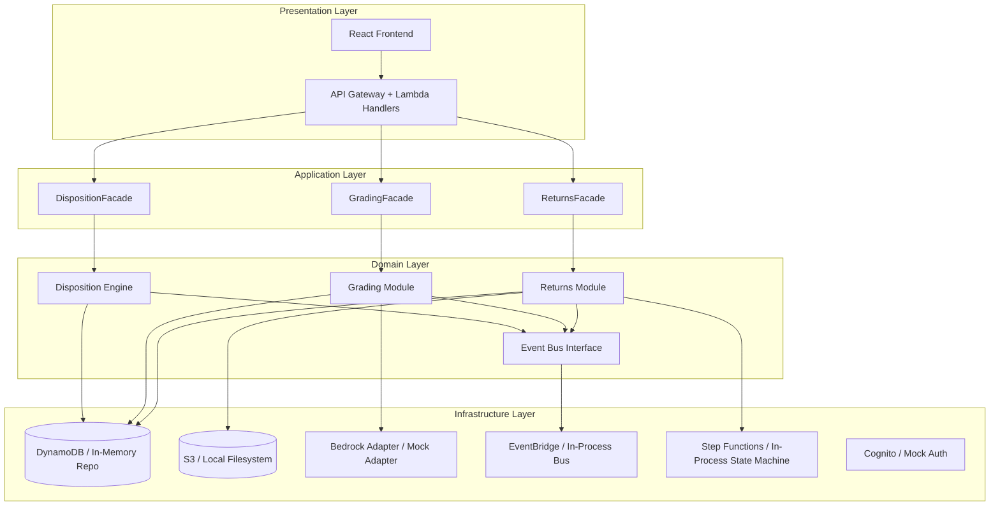
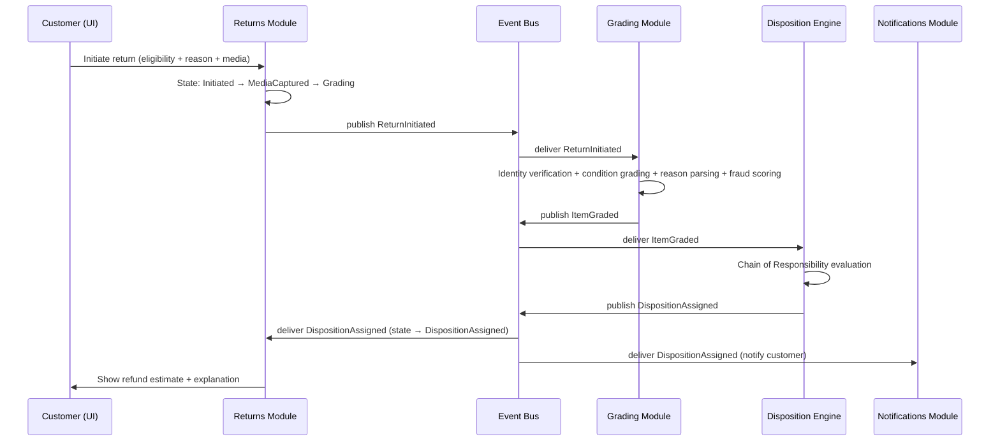
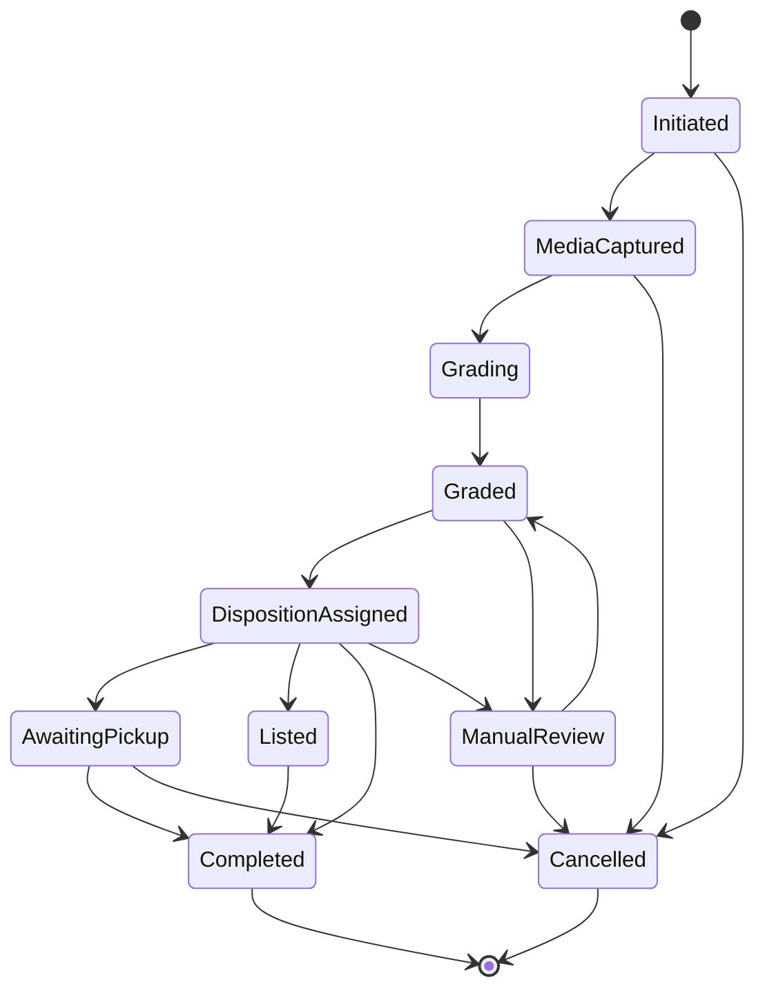
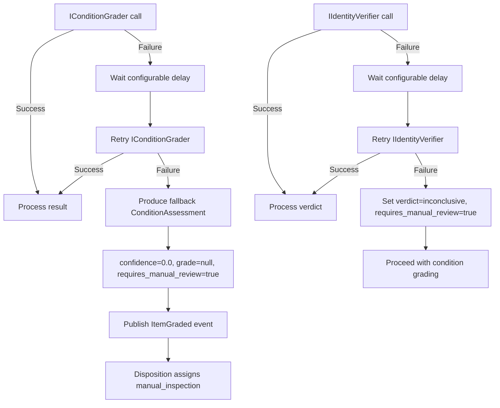

# Design Document: Zero-Touch Returns

## Overview

Zero-Touch Returns moves item grading and disposition from a warehouse to the customer's phone at the moment they tap "Return." The system comprises three tightly integrated subsystems orchestrated via domain events:

1. **Returns Module** — manages the return initiation flow (eligibility, reason capture, guided media capture) and owns the ReturnRequest state machine lifecycle.
2. **Grading Module** — performs AI-powered identity verification, condition assessment, defect detection, reason parsing, and fraud scoring through adapter interfaces with deterministic mocks.
3. **Disposition Engine** — applies an ordered chain of routing handlers to determine each item's next life, produces a refund estimate, and generates a plain-language explanation.

**Key architectural decisions:**
- TypeScript end-to-end (React frontend, Node.js Lambda handlers, CDK infrastructure)
- AWS-native deployed mode (EventBridge, Step Functions, Bedrock, DynamoDB, S3) with in-process local mode (event bus, state pattern, mock adapters)
- Every external service behind an adapter with a deterministic mock — the system runs without live API keys
- Modules communicate only via facades and domain events; no cross-module internal imports
- SOLID principles enforced throughout; Strategy pattern for routing, Chain of Responsibility for the disposition decision ladder, State pattern for ReturnRequest lifecycle

## Architecture

### High-Level System Diagram



### Event-Driven Flow



### Layered Folder Structure

```
src/
├── presentation/
│   ├── api/              # Lambda handlers (returns, grading, disposition)
│   └── web/              # React components for the return flow
├── application/
│   ├── returns/          # ReturnsFacade, use-case orchestrators
│   ├── grading/          # GradingFacade, grading orchestrator
│   └── disposition/      # DispositionFacade, disposition orchestrator
├── domain/
│   ├── returns/          # ReturnRequest entity, state machine, value objects
│   ├── grading/          # ConditionAssessment, IConditionGrader, IIdentityVerifier
│   ├── disposition/      # DispositionDecision, routing handlers, chain
│   └── shared/           # Event bus interface, base entity, domain event types
└── infrastructure/
    ├── persistence/      # DynamoDB adapters, in-memory repos
    ├── ai/               # BedrockGraderAdapter, BedrockVerifierAdapter, mocks
    ├── storage/          # S3 adapter, local filesystem adapter
    ├── events/           # EventBridge adapter, in-process event bus
    ├── auth/             # Cognito adapter, mock auth
    └── config/           # Configuration loader, DI composition root
```

## Components and Interfaces

### Returns Module

#### ReturnRequest Entity (State Pattern)

```typescript
// domain/returns/ReturnRequest.ts

type ReturnState =
  | 'Initiated'
  | 'MediaCaptured'
  | 'Grading'
  | 'Graded'
  | 'DispositionAssigned'
  | 'AwaitingPickup'
  | 'Listed'
  | 'Completed'
  | 'Cancelled'
  | 'ManualReview';

type ReturnReason =
  | 'defective'
  | 'damaged_in_transit'
  | 'wrong_item'
  | 'size_fit'
  | 'not_as_described'
  | 'changed_mind';

interface ReturnRequestProps {
  id: string;
  customerId: string;
  orderItemId: string;
  orderId: string;
  productId: string;
  state: ReturnState;
  reason: ReturnReason | null;
  reasonDetails: string | null; // trimmed, 1-500 chars or null
  media: MediaReference[];
  conditionAssessment: ConditionAssessment | null;
  dispositionDecision: DispositionDecision | null;
  createdAt: Date;
  updatedAt: Date;
}

interface MediaReference {
  id: string;
  type: 'photo_front' | 'photo_back' | 'photo_closeup' | 'video';
  storageKey: string;
  format: 'jpeg' | 'png' | 'mp4' | 'mov';
  sizeBytes: number;
  capturedAt: Date;
}
```

#### State Machine Transition Map

```typescript
// domain/returns/ReturnStateMachine.ts

interface IReturnStateMachine {
  transition(request: ReturnRequest, targetState: ReturnState, actor: string): ReturnRequest;
  getLegalTransitions(currentState: ReturnState): ReturnState[];
}

// Legal transitions (enforced):
const LEGAL_TRANSITIONS: Record<ReturnState, ReturnState[]> = {
  Initiated: ['MediaCaptured', 'Cancelled'],
  MediaCaptured: ['Grading', 'Cancelled'],
  Grading: ['Graded'],
  Graded: ['DispositionAssigned', 'ManualReview'],
  DispositionAssigned: ['AwaitingPickup', 'Listed', 'Completed', 'ManualReview'],
  AwaitingPickup: ['Completed', 'Cancelled'],
  Listed: ['Completed'],
  Completed: [],
  Cancelled: [],
  ManualReview: ['Graded', 'Cancelled'],
};
```

#### State Transition → Event Mapping

| Transition | Domain Event Published |
|---|---|
| → Initiated (creation) | `ReturnInitiated` |
| MediaCaptured → Grading | _(internal, triggers grading)_ |
| Grading → Graded | `ItemGraded` |
| Graded → DispositionAssigned | `DispositionAssigned` |
| DispositionAssigned → AwaitingPickup | `DeliveryJobCreated` |
| DispositionAssigned → Listed | `ListingRequested` |
| DispositionAssigned → ManualReview | `ManualReviewInitiated` + `DeliveryJobCreated` |
| Graded → ManualReview | `ManualReviewInitiated` |
| → Cancelled | `ReturnCancelled` |
| → Completed | `ReturnCompleted` |

**Note on FraudFlagged:** The `FraudFlagged` event is published by the **Grading Module** when `fraudScore >= threshold`, in parallel with `ItemGraded`. It is **not** tied to a state transition — it is an independent domain event emitted during grading. This ensures fraud signals propagate immediately to the Admin module and Disposition Engine regardless of which state path the item follows.

**ManualReview state role:** ManualReview is entered from `DispositionAssigned` when the Disposition Engine assigns the `manual_inspection` route. The transition emits both `ManualReviewInitiated` (notifying Admin) and `DeliveryJobCreated` (triggering pickup to warehouse). The item physically ships to the warehouse while awaiting human review. After review, the admin can transition to `Graded` (re-grade path, triggering re-disposition) or `Cancelled` (reject path). ManualReview can also be entered from `Graded` as an admin override before disposition.

#### Returns Facade

```typescript
// application/returns/IReturnsFacade.ts

interface IReturnsFacade {
  checkEligibility(customerId: string, orderItemId: string): Promise<EligibilityResult>;
  initiateReturn(command: InitiateReturnCommand): Promise<ReturnRequest>;
  submitReason(returnId: string, reason: ReturnReason, details?: string): Promise<ReturnRequest>;
  submitMedia(returnId: string, media: MediaUpload): Promise<ReturnRequest>;
  completeMediaCapture(returnId: string): Promise<ReturnRequest>;
  cancelReturn(returnId: string, actor: string): Promise<ReturnRequest>;
  getReturnById(returnId: string): Promise<ReturnRequestProjection>;
  getGradingProgress(returnId: string): Promise<GradingProgressDTO>;
}

interface EligibilityResult {
  eligible: boolean;
  daysRemaining: number | null;
  policyExpirationDate: Date | null;
  productName: string;
  productImage: string;
  orderDate: Date;
  errorMessage: string | null;
}

interface InitiateReturnCommand {
  customerId: string;
  orderItemId: string;
  orderId: string;
}
```

### Grading Module

#### Adapter Interfaces

```typescript
// domain/grading/IConditionGrader.ts

type ConditionGrade = 'A' | 'B' | 'C' | 'D';

interface Defect {
  location: string;        // e.g., "top-left corner of screen"
  severity: 'minor' | 'moderate' | 'severe';
  description: string;
}

interface ConditionGradeResult {
  grade: ConditionGrade;
  reasoning: string;       // max 500 chars
  defects: Defect[];       // max 10
  confidence: number;      // 0.0–1.0
}

interface IConditionGrader {
  assessCondition(
    mediaReferences: MediaReference[],
    productId: string
  ): Promise<ConditionGradeResult>;
}
```

```typescript
// domain/grading/IIdentityVerifier.ts

type IdentityVerdict = 'genuine' | 'mismatch' | 'inconclusive';

interface IdentityVerificationResult {
  verdict: IdentityVerdict;
  confidence: number;      // 0.0–1.0
}

interface IIdentityVerifier {
  verifyIdentity(
    submittedMedia: MediaReference[],
    catalogImageRef: string,
    productId: string
  ): Promise<IdentityVerificationResult>;
}
```

#### Reason Parser Interface

```typescript
// domain/grading/IReasonParser.ts

type ClaimType = 'damage_description' | 'missing_component' | 'cosmetic_issue' | 'functional_defect';
type ClaimVerdict = 'supported' | 'unsupported' | 'inconclusive';
type ReconciliationStatus = 'aligns' | 'partially_aligns' | 'contradicts' | 'unparseable';

interface ParsedClaim {
  claimType: ClaimType;
  itemArea: string;
  description: string;
  verdict: ClaimVerdict;
}

interface ReasonReconciliation {
  status: ReconciliationStatus;
  claims: ParsedClaim[];
  rawText: string;
}
```

#### ConditionAssessment (Aggregate Output)

```typescript
// domain/grading/ConditionAssessment.ts

interface ConditionAssessment {
  returnRequestId: string;
  grade: ConditionGrade | null;        // null on grading failure
  defects: Defect[];
  reasoning: string;
  confidence: number;                  // 0.0–1.0
  identityVerdict: IdentityVerdict;
  identityConfidence: number;
  fraudScore: number;                  // 0.0–1.0
  reconciliation: ReasonReconciliation;
  requiresManualReview: boolean;
  manualReviewReasons: string[];       // e.g., ["identity inconclusive", "grading timeout"]
  gradedAt: Date;
}
```

#### Fraud Score Computation

```typescript
// domain/grading/FraudScoreCalculator.ts

interface FraudScoreInputs {
  identityVerdict: IdentityVerdict;
  identityConfidence: number;
  reconciliationStatus: ReconciliationStatus;
  unsupportedClaimCount: number;
  returnHistoryCount90Days: number;     // returns in past 90 days
}

interface IFraudScoreCalculator {
  compute(inputs: FraudScoreInputs): number; // returns 0.0–1.0
}

// Rules:
// - identity mismatch → fraud score >= 0.9 regardless of other signals
// - each unsupported claim adds configurable increment (default 0.15)
// - high return frequency adds weight
// - missing signals: compute with remaining, set requires_manual_review
// - if computed score >= threshold (default 0.7), the Grading Module publishes
//   FraudFlagged event in parallel with ItemGraded (decoupled from state machine)
```

#### Grading Facade

```typescript
// application/grading/IGradingFacade.ts

interface IGradingFacade {
  gradeReturn(returnRequestId: string): Promise<ConditionAssessment>;
  getAssessment(returnRequestId: string): Promise<ConditionAssessment | null>;
}
```

#### Mock Implementations

```typescript
// infrastructure/ai/MockConditionGrader.ts
// Returns deterministic grades based on seeded item identifiers:
// - Seeded item "item-grade-a" → Grade A, confidence 0.95
// - Seeded item "item-grade-b" → Grade B, confidence 0.90
// - Seeded item "item-grade-c" → Grade C, confidence 0.85
// - Seeded item "item-grade-d" → Grade D, confidence 0.80
// - Unknown item → Grade B, confidence 0.70 (default fallback)

// infrastructure/ai/MockIdentityVerifier.ts
// Returns deterministic verdicts based on seeded photo sets:
// - Matching catalog photo set → genuine, confidence 0.95
// - Different product photo set → mismatch, confidence 0.95
// - Ambiguous photo set → inconclusive, confidence 0.95
// - Unknown item → inconclusive, confidence 0.50 (default fallback)
```

### Disposition Engine

#### Routing Strategy Interface

```typescript
// domain/disposition/IRoutingStrategy.ts

type DispositionRoute =
  | 'instant_match'
  | 'list_for_resale'
  | 'refurbishment'
  | 'returnless_refund'
  | 'donate_or_recycle'
  | 'manual_inspection';

interface RoutingContext {
  returnRequestId: string;
  conditionAssessment: ConditionAssessment;
  itemValue: number;                    // in ₹
  currency: string;
  nearbyDemand: DemandSignal | null;    // null if unavailable
  productId: string;
  returnReason: ReturnReason;           // drives refund logic (fault vs choice)
  returnHistory: { count90Days: number };
}

interface DemandSignal {
  buyerId: string;
  distanceKm: number;
  matchType: 'active_order' | 'wishlist';
}

interface RoutingResult {
  route: DispositionRoute;
  refundEstimate: RefundEstimate;
  explanation: string;                  // plain-language, max 160 chars
}

interface RefundEstimate {
  amount: number;
  currency: string;
  condition: 'immediate' | 'upon_sale' | 'after_review';
  method: 'original_payment' | 'store_credit';
  isMinimumGuarantee: boolean;
  reasonAware: boolean;              // true when fault reason overrides grade-based %
}
```

#### Reason-Aware Refund Logic

Return reasons are classified into two categories that drive refund calculation:

- **Fault reasons** (defective, damaged_in_transit, wrong_item, not_as_described): The customer is not at fault. Refund is **100% of item price regardless of condition grade**. Physical routing (resale/refurbishment/donate) still uses grade — only the customer's refund changes.
- **Choice reasons** (changed_mind, size_fit): The customer initiated the return by preference. Refund uses the **condition-based percentage** tied to the disposition route.

```typescript
type FaultReason = 'defective' | 'damaged_in_transit' | 'wrong_item' | 'not_as_described';
type ChoiceReason = 'changed_mind' | 'size_fit';

function isFaultReason(reason: ReturnReason): boolean {
  return ['defective', 'damaged_in_transit', 'wrong_item', 'not_as_described'].includes(reason);
}

// Refund computation:
// if isFaultReason(reason) → 100% refund, immediate, regardless of route
// else → route-based percentage (see table below)
```

#### Chain of Responsibility

```typescript
// domain/disposition/IDispositionHandler.ts

interface IDispositionHandler {
  handle(context: RoutingContext): RoutingResult | null;
  setNext(handler: IDispositionHandler): IDispositionHandler;
}
```

**Handler ordering (priority, top to bottom):**

1. **ManualReviewFlagHandler** — if `requiresManualReview` is true → `manual_inspection`
2. **FraudCheckHandler** — if `fraudScore >= 0.7` → `manual_inspection`
3. **LowConfidenceHandler** — if `confidence < 0.6` (and not already flagged) → `manual_inspection`
4. **GradeAInstantMatchHandler** — if grade A + nearby demand within 25km → `instant_match`
5. **GradeAResaleHandler** — if grade A + no nearby demand → `list_for_resale`
6. **GradeBRefurbishmentHandler** — if grade B → `refurbishment`
7. **GradeCDLowValueHandler** — if grade C/D + value < ₹500 → `returnless_refund`
8. **GradeCDHighValueHandler** — if grade C/D + value >= ₹500 → `donate_or_recycle`
9. **DefaultFallbackHandler** — always claims → `manual_inspection` (fallback)

#### Route → State Path Mapping

Each disposition route maps to a state transition from `DispositionAssigned`:

| Route | Transition | Trigger Event |
|---|---|---|
| `instant_match` | DispositionAssigned → AwaitingPickup | `DeliveryJobCreated` |
| `refurbishment` | DispositionAssigned → AwaitingPickup | `DeliveryJobCreated` |
| `manual_inspection` | DispositionAssigned → ManualReview | `ManualReviewInitiated` + `DeliveryJobCreated` (item ships to warehouse for human review) |
| `list_for_resale` | DispositionAssigned → Listed | `ListingRequested` |
| `returnless_refund` | DispositionAssigned → Completed | `ReturnCompleted` (no-pickup) |
| `donate_or_recycle` | DispositionAssigned → Completed | `ReturnCompleted` (no-pickup; customer keeps/disposes locally) |


#### Refund Percentage Configuration (Choice Reasons Only)

For **fault reasons** (defective, damaged_in_transit, wrong_item, not_as_described): always 100% refund, immediate, regardless of route.

For **choice reasons** (changed_mind, size_fit):

| Route | Refund % | Condition |
|---|---|---|
| instant_match | 100% | Immediate |
| returnless_refund | 100% | Immediate |
| list_for_resale | 100% | Upon sale |
| refurbishment | 80% | After review (minimum guarantee) |
| donate_or_recycle | 0% (green credits instead) | Immediate |
| manual_inspection | min tier (e.g. 60%) | After review (minimum guarantee) |

#### Disposition Facade

```typescript
// application/disposition/IDispositionFacade.ts

interface IDispositionFacade {
  evaluateDisposition(returnRequestId: string, assessment: ConditionAssessment): Promise<DispositionDecision>;
  getDecision(returnRequestId: string): Promise<DispositionDecision | null>;
}
```

#### DispositionDecision Entity

```typescript
// domain/disposition/DispositionDecision.ts

interface DispositionDecision {
  returnRequestId: string;
  route: DispositionRoute;
  refundEstimate: RefundEstimate;
  explanation: string;            // plain-language, max 160 chars, no internal jargon
  evaluatedAt: Date;
  handlerName: string;            // which handler claimed it (for audit)
  fallbackTriggered: boolean;
  degradedInputs: string[];       // e.g., ["demand_signal_unavailable"]
}
```

### Event Bus Interface

```typescript
// domain/shared/IEventBus.ts

interface DomainEvent {
  eventId: string;
  eventType: string;
  timestamp: Date;
  payload: Record<string, unknown>;
}

interface IEventBus {
  publish(event: DomainEvent): Promise<void>;
  subscribe(eventType: string, handler: EventHandler): void;
  unsubscribe(eventType: string, handler: EventHandler): void;
}

type EventHandler = (event: DomainEvent) => Promise<void>;
```

#### Domain Event Payloads

```typescript
// domain/shared/events/

interface ReturnInitiatedEvent extends DomainEvent {
  eventType: 'ReturnInitiated';
  payload: {
    returnRequestId: string;
    customerId: string;
    orderItemId: string;
    productId: string;
    reasonCode: ReturnReason;
    mediaReferences: MediaReference[];
  };
}

interface ItemGradedEvent extends DomainEvent {
  eventType: 'ItemGraded';
  payload: {
    returnRequestId: string;
    grade: ConditionGrade | null;
    defects: Defect[];
    identityVerdict: IdentityVerdict;
    confidence: number;
    fraudScore: number;
    requiresManualReview: boolean;
  };
}

interface DispositionAssignedEvent extends DomainEvent {
  eventType: 'DispositionAssigned';
  payload: {
    returnRequestId: string;
    route: DispositionRoute;
    refundEstimate: RefundEstimate;
    explanation: string;
  };
}

interface FraudFlaggedEvent extends DomainEvent {
  eventType: 'FraudFlagged';
  payload: {
    returnRequestId: string;
    fraudScore: number;
    reasons: string[];
  };
}

interface ListingRequestedEvent extends DomainEvent {
  eventType: 'ListingRequested';
  payload: {
    returnRequestId: string;
    productId: string;
    conditionGrade: ConditionGrade;
    assessmentSummary: string;
    mediaReferences: MediaReference[];
  };
}

interface DeliveryJobCreatedEvent extends DomainEvent {
  eventType: 'DeliveryJobCreated';
  payload: {
    returnRequestId: string;
    pickupAddress: string;
    dropAddress: string;
    itemId: string;
    priority: 'standard' | 'urgent';
  };
}
```

### Repository Interfaces

```typescript
// domain/returns/IReturnRequestRepository.ts

interface IReturnRequestRepository {
  save(returnRequest: ReturnRequest): Promise<void>;
  findById(id: string): Promise<ReturnRequest | null>;
  findByCustomerId(customerId: string): Promise<ReturnRequest[]>;
  findByOrderItemId(orderItemId: string): Promise<ReturnRequest | null>;
  countByCustomerInDays(customerId: string, days: number): Promise<number>;
}

// domain/grading/IConditionAssessmentRepository.ts

interface IConditionAssessmentRepository {
  save(assessment: ConditionAssessment): Promise<void>;
  findByReturnRequestId(returnRequestId: string): Promise<ConditionAssessment | null>;
}

// domain/disposition/IDispositionDecisionRepository.ts

interface IDispositionDecisionRepository {
  save(decision: DispositionDecision): Promise<void>;
  findByReturnRequestId(returnRequestId: string): Promise<DispositionDecision | null>;
}

// domain/returns/IAuditLogRepository.ts

interface AuditRecord {
  id: string;
  returnRequestId: string;
  previousState: ReturnState;
  newState: ReturnState;
  timestamp: Date;
  actor: string;    // customerId, "system", or adminId
  trigger: string;  // event or command that caused it
}

interface IAuditLogRepository {
  save(record: AuditRecord): Promise<void>;
  findByReturnRequestId(returnRequestId: string): Promise<AuditRecord[]>;
}
```

### Media Storage Interface

```typescript
// domain/returns/IMediaStorage.ts

interface IMediaStorage {
  getPresignedUploadUrl(key: string, contentType: string, maxSizeBytes: number): Promise<string>;
  getPresignedDownloadUrl(key: string): Promise<string>;
  validateMedia(key: string): Promise<MediaValidationResult>;
  deleteMedia(key: string): Promise<void>;
}

interface MediaValidationResult {
  valid: boolean;
  issues: string[];  // e.g., ["too_blurry", "too_dark", "exceeds_size_limit"]
}
```

## Data Models

### DynamoDB Table Designs

#### ReturnRequests Table

| Attribute | Type | Key |
|---|---|---|
| PK | `RETURN#<returnId>` | Partition Key |
| SK | `META` | Sort Key |
| customerId | String | GSI1-PK |
| orderItemId | String | GSI2-PK |
| state | String | |
| reason | String | |
| reasonDetails | String (nullable) | |
| media | List<Map> | |
| createdAt | String (ISO) | GSI1-SK |
| updatedAt | String (ISO) | |

**GSI1:** `customerId` (PK) + `createdAt` (SK) — query returns by customer  
**GSI2:** `orderItemId` (PK) — query by order item for lookup  
**Uniqueness enforcement:** A conditional write (`attribute_not_exists(PK)`) on a dedicated uniqueness item (`ORDERITEM#<orderItemId>` / `LOCK`) prevents duplicate returns per order item. GSIs do not enforce uniqueness.

#### ConditionAssessments Table

| Attribute | Type | Key |
|---|---|---|
| PK | `ASSESSMENT#<returnRequestId>` | Partition Key |
| SK | `LATEST` | Sort Key |
| grade | String (nullable) | |
| defects | List<Map> | |
| reasoning | String | |
| confidence | Number | |
| identityVerdict | String | |
| fraudScore | Number | |
| reconciliation | Map | |
| requiresManualReview | Boolean | |
| manualReviewReasons | List<String> | |
| gradedAt | String (ISO) | |

#### DispositionDecisions Table

| Attribute | Type | Key |
|---|---|---|
| PK | `DECISION#<returnRequestId>` | Partition Key |
| SK | `LATEST` | Sort Key |
| route | String | |
| refundAmount | Number | |
| refundCurrency | String | |
| refundCondition | String | |
| explanation | String | |
| handlerName | String | |
| fallbackTriggered | Boolean | |
| evaluatedAt | String (ISO) | |

#### AuditLog Table

| Attribute | Type | Key |
|---|---|---|
| PK | `AUDIT#<returnRequestId>` | Partition Key |
| SK | `<timestamp>#<uuid>` | Sort Key |
| previousState | String | |
| newState | String | |
| actor | String | |
| trigger | String | |

### ReturnRequest State Machine Diagram



## Correctness Properties

*A property is a characteristic or behavior that should hold true across all valid executions of a system — essentially, a formal statement about what the system should do. Properties serve as the bridge between human-readable specifications and machine-verifiable correctness guarantees.*

### Property 1: Return Eligibility Calculation Correctness

*For any* delivered order item with a known delivery date and a configured Return_Window duration, the eligibility check SHALL return `eligible = true` with the correct remaining days if and only if the current date is within the Return_Window, and `eligible = false` with the policy expiration date otherwise.

**Validates: Requirements 1.1, 1.2, 1.3**

### Property 2: Ownership Verification

*For any* customer ID and order-item ID pair, the return initiation SHALL succeed if and only if the customer owns the referenced order-item, and SHALL reject with an ownership error otherwise.

**Validates: Requirements 1.7**

### Property 3: Free-Text Reason Validation and Normalization

*For any* input string, the system SHALL trim leading and trailing whitespace, accept strings between 1 and 500 characters after trimming, treat whitespace-only strings as empty (null), and reject strings exceeding 500 characters after trimming.

**Validates: Requirements 2.2, 2.3**

### Property 4: Media Completeness Check

*For any* set of media references, the completeness check SHALL pass if and only if the set contains exactly 3 photos (front, back, closeup) and exactly 1 video, each in a valid format (JPEG/PNG ≤ 10MB for photos, MP4/MOV ≤ 50MB for video).

**Validates: Requirements 3.1, 3.6, 3.8**

### Property 5: Identity Verdict Drives Fraud Score Component

*For any* identity verification result: if verdict is `mismatch` with confidence > 0.8, the fraud score SHALL be ≥ 0.75; if verdict is `genuine` with confidence > 0.8, the identity fraud component SHALL be ≤ 0.1; if verdict is `inconclusive` OR confidence ≤ 0.8, `requires_manual_review` SHALL be set to true.

**Validates: Requirements 4.3, 4.4, 4.5**

### Property 6: Condition Grading Output Invariants

*For any* successful condition grading result, the grade SHALL be one of {A, B, C, D}, the reasoning text SHALL not exceed 500 characters, the defects list SHALL contain at most 10 items each with a valid severity in {minor, moderate, severe}, and the confidence score SHALL be in [0.0, 1.0].

**Validates: Requirements 5.2, 5.3, 5.5**

### Property 7: Grading Failure Produces Valid Fallback

*For any* condition grading invocation that fails (timeout, network error, or service error) and whose single retry also fails, the system SHALL produce a fallback ConditionAssessment with confidence = 0.0, grade = null, `requires_manual_review` = true, and SHALL NOT publish a FraudFlagged event.

**Validates: Requirements 5.6, 9.1, 9.2**

### Property 8: Reason Reconciliation Verdict Logic

*For any* set of parsed claims compared against observed defects, the reconciliation status SHALL be `aligns` when all claims are supported, `partially_aligns` when at least one is supported and at least one is unsupported or inconclusive, and `contradicts` when no claims are supported. Each unsupported claim SHALL increase the fraud score by the configured increment (default 0.15).

**Validates: Requirements 6.2, 6.3, 6.4**

### Property 9: Fraud Score Aggregation and Bounds

*For any* combination of identity verification, reason reconciliation, and return-history signals, the computed fraud score SHALL be in [0.0, 1.0]. If identity verdict is `mismatch`, the fraud score SHALL be ≥ 0.9 regardless of other signals. If any input signal is unavailable, the fraud score SHALL be computed from remaining signals and `requires_manual_review` SHALL be set.

**Validates: Requirements 7.1, 7.3, 7.6**

### Property 10: Fraud Threshold Event Publication

*For any* computed fraud score, a FraudFlagged domain event SHALL be published if and only if the score is greater than or equal to the configurable threshold (default 0.7).

**Validates: Requirements 7.2, 7.5**

### Property 11: Disposition Chain Produces Correct Route

*For any* RoutingContext, the disposition chain SHALL assign routes in strict priority order: (1) `requires_manual_review` = true → `manual_inspection`; (2) `fraudScore` ≥ 0.7 → `manual_inspection`; (3) confidence < 0.6 → `manual_inspection`; (4) grade A + nearby demand within configured radius → `instant_match`; (5) grade A + no nearby demand → `list_for_resale`; (6) grade B → `refurbishment`; (7) grade C/D + value < configured threshold → `returnless_refund`; (8) grade C/D + value ≥ threshold → `donate_or_recycle`; (9) default → `manual_inspection`. When demand signal is unavailable, it SHALL be treated as no nearby demand.

**Validates: Requirements 10.1, 10.3, 10.4, 10.5, 10.6, 10.7, 10.8, 10.9, 10.12, 10.13, 11.1**

### Property 12: Reason-Aware Refund Estimate Calculation

*For any* item price, disposition route, and return reason: if the reason is a fault reason (defective, damaged_in_transit, wrong_item, not_as_described), the refund estimate SHALL be 100% of the item price regardless of route or grade. If the reason is a choice reason (changed_mind, size_fit), the refund estimate SHALL equal the item price multiplied by the configured refund percentage for that route. The `isMinimumGuarantee` flag SHALL be true for routes where the final amount is not predetermined (manual_inspection, refurbishment) and the reason is a choice reason.

**Validates: Requirements 12.2, 11.3**

### Property 13: Explanation Format Invariants

*For any* disposition decision, the plain-language explanation SHALL: (a) not exceed 160 characters; (b) not contain internal identifiers, module names, route codes, raw grade labels, or confidence scores; (c) for manual inspection routes, not contain the words "fraud", "suspicious", "flagged", "violation", "denied", or "penalty", and SHALL include a review timeframe; (d) contain both a reason and a next step.

**Validates: Requirements 13.1, 13.2, 13.4, 13.5**

### Property 14: State Machine Enforces Legal Transitions

*For any* ReturnRequest in state S and any attempted transition to state T, the transition SHALL succeed if and only if (S, T) is in the set of legal transitions. An illegal transition SHALL preserve the current state unchanged and return an error specifying S and T.

**Validates: Requirements 14.2, 14.3**

### Property 15: State Transition Publishes Correct Domain Event

*For any* successful state transition, exactly one domain event SHALL be published on the Event_Bus with the event type corresponding to the transition as defined in the transition-event mapping (excluding FraudFlagged, which is published independently by the Grading Module), and an audit record SHALL be persisted containing the return ID, previous state, new state, timestamp, and actor.

**Validates: Requirements 14.4, 14.5**

### Property 16: Idempotent Event Processing

*For any* domain event delivered multiple times (same event ID), the consuming module SHALL process it exactly once, producing no duplicate side effects (no duplicate ReturnRequests, refunds, assessments, or decisions).

**Validates: Requirements 15.11**


## Error Handling

### Error Handling Strategy

All errors are categorized and handled at the appropriate layer. No raw exceptions propagate to the UI.

#### Error Categories

| Category | Examples | Handling |
|---|---|---|
| **Adapter Timeout** | IConditionGrader > 10s, IIdentityVerifier > 5s | Retry once after configurable delay (default 2s), then fallback |
| **Adapter Error** | HTTP 5xx, network errors from AI services | Same as timeout: retry + fallback |
| **Validation Error** | Invalid file format, oversized upload, empty reason | Reject immediately with user-friendly message |
| **State Machine Violation** | Illegal transition attempt | Reject, preserve state, log, return error with current + attempted state |
| **Authorization Error** | Customer doesn't own order-item | Reject with ownership error |
| **Configuration Error** | Return policy not retrievable | Display "temporarily unavailable" + retry option |
| **Event Delivery Failure** | Subscriber non-acknowledgment within 5s | Retry up to 3 times, then log + system alert |
| **Event Processing Error** | Consumer throws during processing | Log error, do NOT propagate to publisher or other subscribers |

#### Grading Failure Cascade



#### Customer-Facing Error Messages

- **Grading failure:** "We couldn't complete the automatic assessment. Your return has been submitted and will be reviewed by our team within {configured_hours} hours."
- **Eligibility service error:** "We're unable to check return eligibility right now. Please try again in a moment."
- **Upload failure:** "Upload failed. Your previous photos are safe — please try again."
- **Invalid file:** "Please upload a {format_list} file under {max_size}."

### Configurable Parameters

All thresholds and timing values are externalized to configuration:

| Parameter | Default | Description |
|---|---|---|
| `returnWindow.defaultDays` | 30 | Default return window in days |
| `grading.timeoutMs` | 10000 | Max wait for condition grader response |
| `grading.retryDelayMs` | 2000 | Delay before retry on grading failure |
| `identity.timeoutMs` | 5000 | Max wait for identity verifier response |
| `identity.retryDelayMs` | 2000 | Delay before retry on identity failure |
| `fraud.threshold` | 0.7 | Fraud score threshold for FraudFlagged event |
| `fraud.reasonMismatchIncrement` | 0.15 | Fraud score increase per unsupported claim |
| `disposition.confidenceThreshold` | 0.6 | Min confidence for automated routing |
| `disposition.distanceRadiusKm` | 25 | Max distance for nearby buyer demand |
| `disposition.returnlessMaxValue` | 500 | Max item value (₹) for returnless refund |
| `disposition.refundPercentages` | See table | Per-route refund percentages |
| `events.ackTimeoutMs` | 5000 | Event acknowledgment timeout |
| `events.maxRetries` | 3 | Max event delivery retries |
| `manualReview.slaHours` | 24 | SLA for manual review completion |
| `media.maxPhotoSizeMb` | 10 | Max photo file size |
| `media.maxVideoSizeMb` | 50 | Max video file size |
| `progress.maxStepIntervalMs` | 5000 | Max time between progress step updates |

## Testing Strategy

### Dual Testing Approach

This feature uses both unit tests (example-based) and property-based tests (PBT) for comprehensive coverage. The pure domain logic is well-suited to PBT due to its clearly defined input/output behavior, universal invariants, and large input spaces.

### Property-Based Testing Library

**Library:** [fast-check](https://github.com/dubzzz/fast-check) (TypeScript)

**Configuration:**
- Minimum 100 iterations per property test
- Each property test tagged with: `Feature: zero-touch-returns, Property {N}: {title}`
- Custom arbitraries for domain value objects (ReturnReason, ConditionGrade, MediaReference, RoutingContext)

### Property Test Implementation Plan

Each correctness property maps to a single property-based test:

| Property | Test Focus | Key Generators |
|---|---|---|
| 1: Eligibility Calculation | Date arithmetic | Random delivery dates, window durations, current dates |
| 2: Ownership Verification | Access control | Random customer-orderItem pairs (matching/non-matching) |
| 3: Free-Text Validation | Input normalization | Random strings (whitespace, unicode, boundary lengths) |
| 4: Media Completeness | Set validation | Random media sets (varying types, formats, sizes) |
| 5: Identity → Fraud Score | Rule application | Random identity verdicts + confidence scores |
| 6: Grading Output Invariants | Output bounds | Random grading results |
| 7: Grading Failure Fallback | Failure handling | Random failure scenarios (timeout/error/both) |
| 8: Reconciliation Logic | Verdict classification | Random claim sets + defect sets |
| 9: Fraud Score Aggregation | Score composition | Random signal combinations (present/absent) |
| 10: Fraud Threshold Event | Threshold check | Random fraud scores around boundary |
| 11: Disposition Chain | Routing correctness | Random RoutingContexts (all permutations) |
| 12: Refund Estimate | Arithmetic | Random prices + routes + reasons (fault vs choice) |
| 13: Explanation Invariants | Content constraints | Random disposition decisions |
| 14: Legal Transitions | State machine | Random (state, targetState) pairs |
| 15: Transition Events | Event correctness | Random legal transitions |
| 16: Idempotent Processing | Deduplication | Random events delivered multiple times |

### Unit Test Coverage

Example-based tests for specific scenarios and edge cases:

- **Return initiation flow:** happy path, ineligible item, service errors
- **Media capture:** progressive disclosure, retake, format rejection, network error resilience
- **Mock adapters:** verify seeded data returns expected deterministic results
- **State machine:** specific transition sequences, multi-item returns creating separate requests
- **Event bus:** error isolation, retry behavior, non-propagation
- **UI integration:** progress indicator steps, delay message at 10s, disabled controls

### Integration Tests

- End-to-end flow: initiation → grading → disposition → event fan-out
- Event bus delivery and acknowledgment timing
- Adapter timeout/retry behavior with real timing
- DI configuration switching between mock and live adapters

### Architecture Tests (Static Analysis)

- No cross-module internal imports (build-time lint rule)
- All external services accessed through adapter interfaces only
- Facade interfaces expose read-only projections
- Each routing strategy is a separate class file
